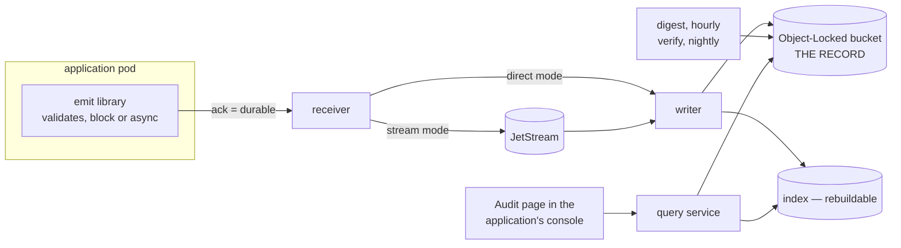

# audit

An audit trail an application owns: one record format, one write path, an
immutable archive, and projections for security, billing and history.

An installation belongs to **one application** and runs in its namespace,
rendered by its chart. The application emits through a library; the
receiver, the writer and the query service are separate Deployments, so the
application holds no credentials for the archive and a fix never rebuilds
it.

## The two shapes

| shape | for | how a record becomes durable |
|---|---|---|
| [direct](docs/deployment/direct.md) | an internal service, or a cluster with no stream | the receiver puts the object, then acknowledges |
| [stream](docs/deployment/stream.md) | a product: many pods, metering, quotas | the receiver publishes, writers consume and put |

Both write the same archive and are verified by the same command. There is
no shape that puts the writer inside the application
([why](docs/decisions/0011-one-installation-per-service-or-product.md)).

## The two extensions

| extension | what it adds | needs |
|---|---|---|
| [billing](docs/deployment/extensions/billing.md) | rollups at index time, an immutable monthly statement | a metering profile |
| [usage quotas](docs/deployment/extensions/quotas.md) | a usage consumer, a counter cache, an hourly reconciler | stream mode |

## Start here

| you want to | read |
|---|---|
| see how it fits together | [Architecture](docs/architecture.md) — the parts, the catalogue, what an acknowledgement means, what can be lost |
| connect an application | [Integrating](docs/guides/integrate.md) — the catalogue, one constructor per action, the CI check, the Audit page |
| run one in a cluster | [Deployment](docs/deployment/README.md) — what to prepare, then [direct](docs/deployment/direct.md) or [stream](docs/deployment/stream.md) |
| record what your application does | [Emitting](docs/guides/emit.md) — deliveries, registration, the Go emitter; [`examples/emit`](examples/emit/main.go) |
| search the trail, or audit it | [Reading](docs/guides/read.md) — grants, the API, the clients, `audit verify`; [`examples/read`](examples/read/main.go) |
| know which presets to compose | [Presets policy](docs/operations/presets-policy.md), then [presets/](presets/README.md) |
| understand why it is built this way | [why](docs/why.md), [concepts](docs/concepts.md), [the decisions](docs/decisions/README.md) |
| work on this repository | [layout](docs/development/layout.md), [CONTRIBUTING](CONTRIBUTING.md) |

## Status

| part | state |
|---|---|
| Record, catalogues, presets, `audit validate` / `check-emitters` | built |
| Go emitter: `block` and `async`; Connect and JetStream sinks | built |
| Writer: split per profile, Object Lock where a profile demands it, index, dead letters, legal holds, retention addenda | built |
| Two store tiers on any S3-compatible store: `record` (Object Lock in compliance mode) and `attested` (chain under a managed key, no lock) ([0014](docs/decisions/0014-lock-modes-and-store-tiers.md)) | built |
| Query service: search, facets, get, export, tail; JWT with declarative grants | built |
| Digest chain and `audit verify`; signing with a key file, AWS KMS or OpenBAO transit | built |
| Pseudonymisation keys: `local` and OpenBAO transit, **off by default** ([0013](docs/decisions/0013-no-pseudonymisation-keys-by-default.md)) | built |
| Helm chart: `mode`, receiver, writer, query service, the four jobs, the extension toggles | built; a golden per shape, and every documented example rendered |
| `@truvity/audit`: query client, sentences, React hooks and view | built; consumed from a release tag (`github:truvity/audit#vX.Y.Z`), not from a registry |
| TypeScript emitter | designed, not built |
| Billing statement, usage consumer, reconciler | designed, not built |
| Exporters (OCSF, ECS, Parquet), adapters | designed, not built |

## What it is not

- **Not an application log pipeline.** Logs keep flowing through the
  observability stack. This records what happened, who did it, to what, with
  what outcome, and keeps it for as long as a framework requires.
- **Not a SIEM.** It exports to one.
- **Not a wallet transaction log.** A digital identity wallet's own log
  lives on the user's device and is invisible to the provider by law. This
  component sees operational events only.

## Licence

MIT. See [LICENSE](LICENSE).
