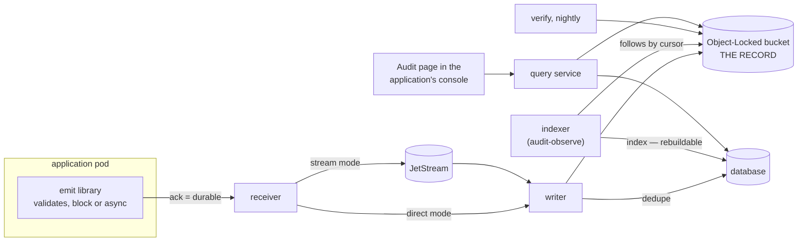

# audit

An audit trail an application owns: one record format, one write path, an
immutable archive, and projections for security, billing and history.

An installation belongs to **one application** and runs in its namespace,
rendered by its chart. The application emits through a library; the
receiver, the writer and the query service are separate Deployments, so the
application holds no credentials for the archive and a fix never rebuilds
it.


```mermaid
flowchart LR
  subgraph app["application pod"]
    E["emit library<br/>validates, block or async"]
  end
  E -- "ack = durable" --> R["receiver"]
  R -- "direct mode" --> W["writer"]
  R -- "stream mode" --> N[("JetStream")] --> W
  W --> S3[("Object-Locked bucket<br/>THE RECORD")]
  W -- "dedupe" --> PG[("database")]
  O["indexer<br/>(audit-observe)"] -- "follows by cursor" --> S3
  O -- "index — rebuildable" --> PG
  D["verify, nightly"] --> S3
  Q["query service"] --> PG
  Q --> S3
  UI["Audit page in the<br/>application's console"] --> Q
```

## Who it is for

An application team that already has, or can provision, a Postgres
database, an S3-compatible bucket with Object Lock and a reference clock — the things
[Before either shape](docs/deployment/README.md#before-either-shape) lists.

It deliberately does not install: a central, multi-tenant audit service (an
installation belongs to one application,
[0011](docs/decisions/0011-one-installation-per-service-or-product.md));
its own message bus (stream mode consumes the application's existing
JetStream); or the Audit page itself, which lives in the application's own
console and only calls the query service.

## The model

An **installation** is one deployment of this chart, in one application's
namespace, in one of the two **shapes** (`direct` or `stream`). It writes
**records** — validated against the application's **catalogue** — through a
**receiver** into the **archive** (an Object-Locked bucket) and an
**index** (Postgres, rebuildable, not itself evidence), which an **indexer**
(`audit-observe`) writes by following the bucket. A **query service**
reads the index and the archive back out, behind grants the installation's
values declare.

## Install and a worked example

This chart is instantiated, not deployed standalone: an installation
belongs to one application and is rendered by that application's own
chart, which takes this one as a dependency
([0011](docs/decisions/0011-one-installation-per-service-or-product.md)).

```yaml
# the application chart's Chart.yaml
dependencies:
  - name: audit
    version: 0.4.0
    repository: oci://ghcr.io/truvity/charts
```

Then the application's own `values.yaml` sets what this chart reads under
the `audit:` key. The `direct` shape, abridged from a worked example
([`charts/audit/examples/direct.yaml`](charts/audit/examples/direct.yaml),
rendered as one of this repository's golden fixtures):

```yaml
audit:
  mode: direct
  replicas: 2
  profiles:
    security:
      presets: [security]
  externalIdentifiersAreOpaque: true
  workloadIdentity:
    issuers:
      - url: https://oidc.example.com/id/CLUSTER
    workloads:
      - subject: system:serviceaccount:app:api
        source: app
  migrate:
    enabled: true
    config:
      database:
        url: postgres://audit@db.example.com:5432/audit?sslmode=verify-full
        passwordEnv: AUDIT_DATABASE_PASSWORD
      reader: audit_query
    secretEnv:
      - {name: AUDIT_DATABASE_PASSWORD, secretName: audit-db, key: password}
  writer:
    config:                          # audit-writer's own configuration file
      deployment: /etc/audit/deployment.yaml
      workloads: /etc/audit/workloads.yaml
      replicas: 2
      archive:
        bucket: {name: audit-eu-example-1, region: eu-example-1}
        prefix: audit/app
        kmsKey: alias/audit-archive
      database:
        url: postgres://audit@db.example.com:5432/audit?sslmode=verify-full
        passwordEnv: AUDIT_DATABASE_PASSWORD
    secretEnv:                       # the Secret behind that variable name
      - {name: AUDIT_DATABASE_PASSWORD, secretName: audit-db, key: password}
  # query, and the verify, purge and clock-sync jobs, each take a
  # `config:` the same way; see the example file below
```

Each `config:` is the binary's own configuration file, validated against the
schema in `schemas/config/` both when the chart renders and when the process
starts; a secret is named there and supplied by `secretEnv`. The keys are in
the [configuration reference](docs/reference/configuration.md).

[stream mode's example](charts/audit/examples/stream.yaml) is the same
shape with a JetStream receiver; both render as golden fixtures
`tests/golden/audit/example-direct.yaml` and
`tests/golden/audit/example-stream.yaml`, so the example it is abridged
from is proven to render, not just plausible.

## The two shapes

| shape | for | how a record becomes durable |
|---|---|---|
| [direct](docs/deployment/direct.md) | an internal service, or a cluster with no stream | the receiver puts the object, then acknowledges |
| [stream](docs/deployment/stream.md) | a product: many pods, metering, quotas | the receiver publishes, writers consume and put |

Both write the same archive and are verified by the same command. There is
no shape that puts the writer inside the application
([why](docs/decisions/0011-one-installation-per-service-or-product.md)).

## The two extensions

| extension | what it adds | needs |
|---|---|---|
| [billing](docs/deployment/extensions/billing.md) | rollups at index time, an immutable monthly statement | a metering profile |
| [usage quotas](docs/deployment/extensions/quotas.md) | a usage consumer, a counter cache, an hourly reconciler | stream mode |

## Consumers

| repo | surface |
|---|---|
| truvity/gitops | chart `audit` |
| A second, non-AWS estate | chart `audit` |
| truvity/cloudflare | Go, from `r2broker` |

## Neighbours

- **access-roster ↔ openbao ↔ audit.** access-roster is the issuer; openbao
  is a relying party (its own `docs/integrations/access-roster.md`); audit is
  the record every one of them writes.

## Documentation

| you want to | read |
|---|---|
| see how it fits together | [Architecture](docs/architecture.md) — the parts, the catalogue, what an acknowledgement means, what can be lost |
| connect an application | [Integrating](docs/guides/integrate.md) — the catalogue, one constructor per action, the CI check, the Audit page |
| run one in a cluster | [Deployment](docs/deployment/README.md) — what to prepare, then [direct](docs/deployment/direct.md) or [stream](docs/deployment/stream.md) |
| record what your application does | [Emitting](docs/guides/emit.md) — deliveries, registration, the Go emitter; [`examples/emit`](examples/emit/main.go) |
| search the trail, or audit it | [Reading](docs/guides/read.md) — grants, the API, the clients, `audit verify`; [`examples/read`](examples/read/main.go) |
| know which presets to compose | [Presets policy](docs/operations/presets-policy.md), then [presets/](presets/README.md) |
| understand why it is built this way | [why](docs/why.md), [concepts](docs/concepts.md), [the decisions](docs/decisions/README.md) |

## The rule that makes this repository public

Mechanism only: nothing in this repository may name a real organisation,
cluster, account, team, person, incident or internal ticket
([CONTRIBUTING](CONTRIBUTING.md)). Every chart value that names a cluster,
an account, a hostname or a secret path is an input with a neutral
default — the consuming estate supplies the particulars from its own,
private repository. `hack/leak-canary.sh` enforces it on tracked files,
and `just check` runs it.

This repository follows the shared
[component contract](https://github.com/truvity/policy/blob/master/docs/contracts/component.md).

## Status

| part | state |
|---|---|
| Record, catalogues, presets, `audit validate` / `check-emitters` | built |
| Go emitter: `block` and `async`; Connect and JetStream sinks | built |
| Writer: split per profile, Object Lock where a profile demands it, index, dead letters, legal holds, retention addenda | built |
| Two store tiers on any S3-compatible store: `record` (Object Lock in compliance mode) and `attested` (no lock) ([0014](docs/decisions/0014-lock-modes-and-store-tiers.md)) | built |
| Query service: search, facets, get, export, tail; JWT with declarative grants | built |
| The v1 bucket layout and `audit verify`, which checks every record object against the [bucket contract](docs/reference/bucket-contract.md); signers (key file, AWS KMS, OpenBAO transit) for the seals that will follow | built; seals are not |
| Pseudonymisation keys: `local` and OpenBAO transit, **off by default** ([0013](docs/decisions/0013-no-pseudonymisation-keys-by-default.md)) | built |
| Helm chart: `mode`, receiver, writer, query service, the three jobs, the extension toggles | built; a golden per shape, and every documented example rendered |
| `@truvity/audit`: query client, sentences, React hooks and view | built; consumed from a release tag (`github:truvity/audit#vX.Y.Z`), not from a registry |
| TypeScript emitter | designed, not built |
| Billing statement, usage consumer, reconciler | designed, not built |
| Exporters (OCSF, ECS, Parquet), adapters | designed, not built |

## What it is not

- **Not an application log pipeline.** Logs keep flowing through the
  observability stack. This records what happened, who did it, to what, with
  what outcome, and keeps it for as long as a framework requires.
- **Not a SIEM.** It exports to one.
- **Not a wallet transaction log.** A digital identity wallet's own log
  lives on the user's device and is invisible to the provider by law. This
  component sees operational events only.

## Development

Tools come from `devbox.json` through direnv; `devbox shell` puts them on
PATH. `just check` is the gate — it needs nothing but this checkout: no C
toolchain, no network. It builds, tests, lints, renders the chart against
every golden under `tests/golden/audit/` and every refusal in
`tests/invalid/audit/refusals.txt`, and runs the leak canary.

`just chart` regenerates the chart's goldens (review the diff before
committing); `just drift-ts` regenerates the TypeScript client's generated
code. `just race`, `just conformance` and the other recipes that need a C
toolchain, Docker, or the network are separate, for the same reason: a gate
that fails because of what somebody else's environment lacks is a gate
people learn to ignore. See [CONTRIBUTING](CONTRIBUTING.md) for the rest.

## Releasing

A pushed `v*` tag runs [`release.yaml`](.github/workflows/release.yaml), the
shared `release-public` workflow
([truvity/ci-workflows](https://github.com/truvity/ci-workflows)): it builds
the toolchain archives and, through `ko`, the three images the chart
deploys, and packages and pushes the `audit` chart to
`oci://ghcr.io/truvity/charts/audit` at the tag's version.
[`charts/audit/Chart.yaml`](charts/audit/Chart.yaml)'s committed
`version: 0.0.0` / `appVersion: "0.0.0"` are placeholders the release
stamps over — never bump them by hand. The CLI is also published as a Nix
flake release asset, for pinning `audit verify` the way other repositories
pin `accessctl`.

## Licence

MIT. See [LICENSE](LICENSE).
