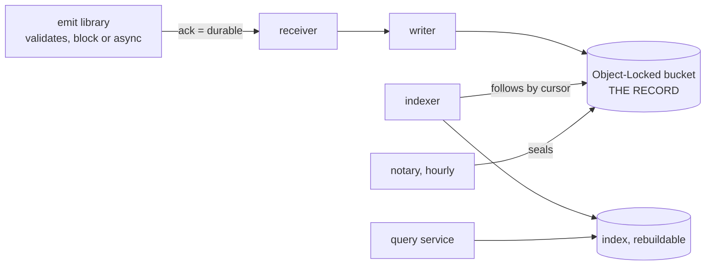

# audit

An audit trail an application owns: one record format, one write path, an immutable archive, and
projections for security, billing and history. An application emits records through a library; the
writer puts them in an Object-Locked bucket, an indexer follows the bucket into Postgres for search,
a notary seals each hour, and `audit verify` lets an auditor check the archive with read access to
the bucket and nothing else.

**Status: stabilizing.** A minor release may carry a breaking change with a **Breaking:** entry in the
[CHANGELOG](CHANGELOG.md) and a migration page under [`docs/how-to/upgrade/`](docs/how-to/upgrade/v0.13.md);
a patch never does ([policy decision 0012](https://github.com/truvity/policy/blob/master/docs/decisions/0012-stabilization-amendments.md)).

```mermaid
flowchart LR
  E["emit library<br/>validates, block or async"] -- "ack = durable" --> R["receiver"]
  R --> W["writer"] --> S3[("Object-Locked bucket<br/>THE RECORD")]
  O["indexer"] -- "follows by cursor" --> S3
  O --> PG[("index, rebuildable")]
  N["notary, hourly"] -- "seals" --> S3
  Q["query service"] --> PG
```

## Shapes

An installation belongs to **one application** and runs in that application's namespace
([0011](docs/decisions/0011-one-installation-per-service-or-product.md)). It comes in three shapes,
each with a tutorial from nothing to working:

| shape | for | start |
|---|---|---|
| Kubernetes, with the chart | an internal service (direct) or a product (stream) | [Getting started on Kubernetes](docs/getting-started/kubernetes.md) |
| AWS Lambda, with the Pulumi library | writer and notary as functions behind an SQS queue | [Getting started on AWS Lambda](docs/getting-started/aws-lambda.md) |
| connected to sluis | audit's half of an access-management install | [Getting started with a sluis-connected install](docs/getting-started/sluis.md) |

They write the same archive, under the same catalogue rules and bucket layout, and are verified by the
same command. The two combine: writer on Lambda, observe and query in Kubernetes.

## Artifacts

| artifact | where |
|---|---|
| chart `audit` | `oci://ghcr.io/truvity/charts/audit` ([chart README](charts/audit/README.md)) |
| images `audit-writer`, `audit-query`, `audit-observe`, `audit-notary`, `audit` | `ghcr.io/truvity/audit/<name>` |
| Lambda zips `audit-writer-lambda_<version>_linux_arm64.zip`, `audit-notary-lambda_<version>_linux_arm64.zip` | the GitHub release, with `checksums.txt` |
| Pulumi library | `github.com/truvity/audit/deploy/pulumi` ([reference](docs/reference/aws-pulumi-library.md)) |
| Go SDK: record, catalogue, emitter, sink | `github.com/truvity/audit/sdk` |
| `audit` CLI (verify, hold, reindex, migrate, ...) | the GitHub release archives |
| `@truvity/audit`: query client, sentences, React view | GitHub Packages, at each release tag |
| JSON Schemas of the record, the catalogue and every configuration file | `https://truvity.github.io/audit/schemas/` ([`schemas/`](schemas/README.md)) |

## Documentation

[`docs/`](docs/README.md) is organised by what you are doing: tutorials in
[`getting-started/`](docs/getting-started/kubernetes.md), tasks and runbooks in
[`how-to/`](docs/how-to/), lookups in [`reference/`](docs/reference/configuration.md), the why in
[`explanation/`](docs/explanation/architecture.md) and the [decisions](docs/decisions/README.md). The
changelog says what changed; the steps to take are in [`how-to/upgrade/`](docs/how-to/upgrade/v0.13.md).

## What it is not

- **Not an application log pipeline.** Logs keep flowing through the observability stack. This records
  what happened, who did it, to what, with what outcome, and keeps it as long as a framework requires.
- **Not a SIEM.** It exports to one.
- **Not a central, multi-tenant audit service.** An installation belongs to one application.

## Development

Tools come from `devbox.json` through direnv. `just check` is the gate and needs nothing but this
checkout. [CONTRIBUTING](CONTRIBUTING.md) has the rest, and
[the repository layout](docs/reference/repository-layout.md) says where things are.

This repository is public: mechanism only, with nothing that names a real organisation, cluster, account,
team, person or incident ([CONTRIBUTING](CONTRIBUTING.md)). It follows the shared
[component contract](https://github.com/truvity/policy/blob/master/docs/contracts/component.md).

## Licence

MIT. See [LICENSE](LICENSE).
