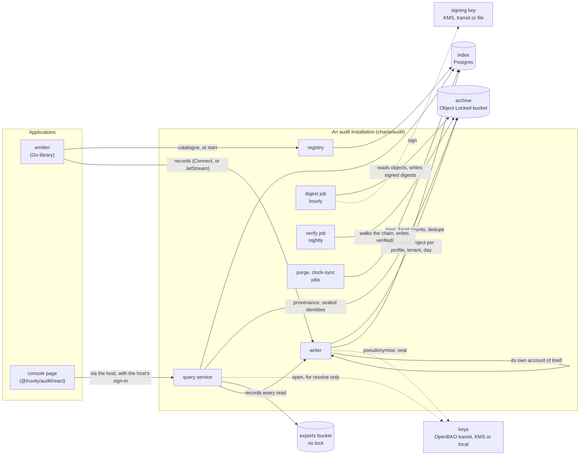

# Architecture

What is built, how the parts fit, and what each part holds — and must never
hold. [Concepts](concepts.md) defines the vocabulary; the
[design pages](README.md) explain each part in depth; the
[decisions](decisions/README.md) say why.

## The parts

| part | what it does | holds | never holds |
|---|---|---|---|
| **emitter** (`emit`) | validates each record against the catalogue, then delivers it: `block` (the call waits for the archive), `outbox` (a local file, retried) or `best_effort` (may drop, and says so) | the catalogue; an outbox file | keys; the archive's credentials |
| **registry** (`audit-registry`) | takes an application's catalogue at start-up and refuses one the deployment's profiles cannot keep | catalogues, in Postgres | bucket rights; keys |
| **writer** (`audit-writer`, or `writer.Open` embedded) | validates again, splits a record into one copy per profile, applies each profile's identity treatment, rolls copies into objects, puts them under Object Lock, indexes them | the pseudonymisation keys (or a role that may use them); write rights on the archive | the signing key; any right to read what it wrote back to a caller |
| **query service** (`audit-query`, or `query.New` embedded) | answers search, facets, get, export, tail and resolve behind the caller's grant, and records each read through the writer | read on the index and the archive; write on the exports bucket; decrypt on the keys **only** if it resolves | write on the archive; the signing key |
| **digest job** (`audit digest`) | every hour, per profile, signs a digest of every object written in that hour and links it to the previous one | the signing key | the pseudonymisation keys; write outside `digest/` |
| **verify job** (`audit verify`) | walks the chain with the public key and reports anything changed, added or missing | the public key | any private key |
| **purge, clock-sync** | bring the index back within the profiles' retention; record the clock's offset from UTC daily | the index; nothing | — |
| **console page** (`@truvity/audit/react`) | shows a profile's records as sentences, with search, detail, integrity and live updates | nothing: it asks through the host's transport | credentials of its own |

## Two ways to run it

**An installation, with applications as plugins.** The chart deploys the
writer, registry, query service and jobs, with Postgres for the index. An
application connects: it registers its catalogue with the registry, emits to
the writer with its workload identity (a projected service-account token), and
mounts the console page in its own console, which proxies to the query service
under the application's sign-in. This is the shape for more than one
application, and the one [integrating](guides/integrate.md) describes.

**Embedded.** An application with nowhere to send records can open a writer
and a query service inside its own process (`writer.Open`, `query.New`) and
write straight to the bucket. [Embedding](guides/embed.md) describes it; the
guarantees are the same.

Records can reach the writer over Connect directly or through a JetStream
stream with a durable consumer; the stream turns a writer that is down into a
backlog rather than a hole.

## The life of one record

1. **The application records an action.** The emitter fills what it knows
   (id, time, source, sequence, the request's client address and ids),
   validates the record against the catalogue — the action exists, the data
   matches its schema, nothing on the negative list is present — and delivers
   it as the catalogue declares.
2. **The writer checks it again**, against the same catalogue resolved from
   the registry, and stamps what it verified itself: `recorded_at`, the
   observer (the caller's service account, from its token), and the
   `origin_hash` over the canonical form.
3. **It splits the record** into one copy per profile the action names. Each
   copy keeps only the fields that profile's presets allow (default-deny),
   and each actor or subject is treated by its kind's category: kept in
   clear, replaced by a keyed pseudonym (one key per tenant and purpose), or
   dropped. Where resolve is kept, the identity behind a pseudonym is sealed
   under the same key.
4. **It rolls copies into objects** — one per profile, tenant and day — and
   puts each with an Object Lock retention computed from the profile: a fixed
   number of days, or years after the credential the record is about expires.
   Nothing is acknowledged before the object is in the bucket. A record the
   writer cannot take is written to the dead-letter prefix, never dropped.
5. **It indexes** each copy's row and facet counts in Postgres, and marks the
   record's id as written so a redelivery is absorbed.
6. **Every hour the digest job** signs, per profile, a digest listing every
   object of that hour with its hash and the previous digest's hash —
   including for a quiet hour, so that silence can be told from removal.
7. **Every night the verify job** walks the chain with the public key and
   records what it checked, which `Get` later reports as a record's
   `verified_at`.
8. **A reader asks** through the query service. The caller's token names
   them; the grants say which profiles, tenants, operations and period they
   may read; the grant becomes one more term of the query, so there is no path
   to a row outside it. The read itself is recorded (`audit.search`,
   `audit.get`, …) before or as it is answered.

The writer keeps its own account in the archive it writes (`audit.writer.*`),
and every job records what it did, so the trail says when it was and was not
being kept.

## Built, designed, not yet

| | state |
|---|---|
| record, catalogue, presets, emitter, writer, registry, query service, digest chain, verify, legal holds, retention addenda | built |
| keys: `local`, OpenBAO `transit` | built |
| keys: AWS KMS envelope | designed ([key custody](operations/key-custody.md)); not built |
| signers: key file, AWS KMS, OpenBAO transit | built |
| searchers: Postgres, archive scan, memory | built |
| Helm chart for the installation | built |
| `@truvity/audit` TypeScript package and React view to embed | built; published with the first release |
| a standalone console | not built — the first applications host the page in their own console |
| metering projection, exporters (OCSF, ECS, Parquet), adapters | designed; not built |
