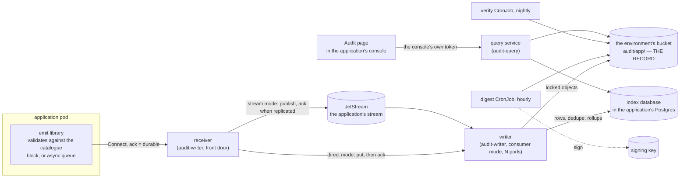
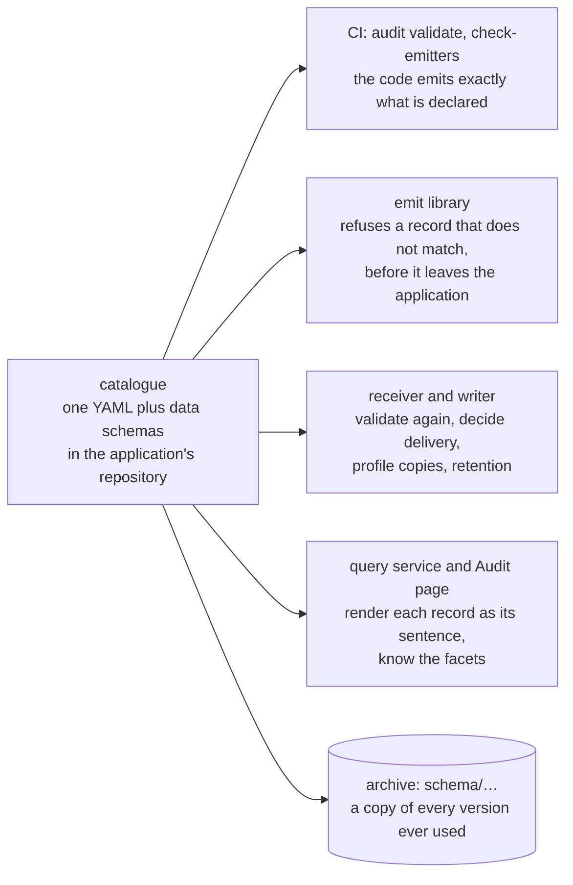

# Architecture

One installation belongs to one application. This page says what the parts
are, what each holds and must never hold, how the application's catalogue
binds them together, what an acknowledgement means, and what can be lost.

[Concepts](concepts.md) defines the vocabulary. The
[deployment pages](deployment/direct.md) show each shape as it is actually
run. The [decisions](decisions/README.md) say why, starting with
[0011](decisions/0011-one-installation-per-service-or-product.md).

## The parts

| part | runs as | holds | never holds |
|---|---|---|---|
| **emit** | a library in the application (`emit`) | the compiled-in catalogue, a bounded in-memory queue | credentials for the bucket, the index or the stream |
| **receiver** | `audit-writer`, one or two pods, the application's front door over Connect | the stream's credentials in stream mode, and it serves `RegisterCatalogue` | — |
| **writer** | the same image in consumer mode, N pods (stream mode); the receiver itself (direct mode) | write rights on its prefix, the index owner's credentials | the signing key, any way to hand a record back to a caller |
| **stream** | one JetStream stream on the application's own account (stream mode only) | records not yet archived, replicated | — |
| **bucket** | one per environment, Object Lock in compliance mode where a profile demands it | every record, one copy per profile, locked or chained | — |
| **index** | one database in the application's existing Postgres | rows, facet counts, the dedupe table, rollups | anything that is not rebuildable |
| **digest / verify** | two CronJobs | the signing key (digest), the public key (verify) | write rights outside `digest/` and `verified/` |
| **query service** | `audit-query`, one or two pods | a read-only index role, read on the prefix, the application's grants | write on the archive, the signing key |
| **Audit page** | a React component in the application's console | nothing — it calls the query service with the console's own token | credentials of its own |
| **usage consumer** | a small Deployment, [quotas](deployment/extensions/quotas.md) only | the counter cache | — |

Two things follow from the table. The application holds no credentials for
anything the trail is kept in, so a compromised application pod cannot reach
the archive except by emitting records. And nothing in the write path can
read a record back out: the query service is the only way in, and it records
every read.

## The catalogue is the contract

One YAML file lives next to the application's code, with a JSON Schema for
each action that carries data. It names every action the application
records and, for each, what kind of operation it is, what frameworks call
it, which profiles keep a copy (and therefore for how long), what it is
about, who may act, the schema of its data, its delivery, and how it reads
as a sentence.

- **One per application, not shared.** What is shared, and shipped here, is
  the format and the [presets](../presets/README.md) that profiles are
  composed from. A catalogue names profiles; it never defines them.
- **Versioned with the code.** Every record names the catalogue version it
  was written under, and the archive keeps a copy of every version, so a
  record written last year still reads correctly after the catalogue
  changed.
- **It reaches the receiver at start-up**, over `RegisterCatalogue`. A
  malformed catalogue is refused and the application does not start; a
  receiver that is merely unreachable is retried. There is no registry
  service: the receiver serves that call, because an installation has one
  application to hear it from
  ([0011](decisions/0011-one-installation-per-service-or-product.md)).
- **One constructor per action in the application's code**, so the name is
  spelled once and `check-emitters` can hold the code to the file.

[The catalogue reference](reference/catalogue.md) is the full format.

## What an acknowledgement means

Delivery is chosen per action in the catalogue, not per installation.

| delivery | the application's call returns | if the receiver is down | for |
|---|---|---|---|
| `block` | when the receiver has acknowledged durability | the action **fails** | a privileged sign-in, a key destruction, a billable operation |
| `async` (default) | at once | the record waits in a bounded queue and is retried with backoff | everything else |

**The acknowledgement always means durable.** In stream mode that is the
stream's replicated publish acknowledgement. In direct mode it is the object
in the bucket: the receiver puts every batch it takes before answering, under
either delivery. The difference is only who waits — the application under
`block`, its own queue under `async`.
[0012](decisions/0012-two-deliveries-and-a-durable-ack.md) has the
reasoning.

## What each mode can lose

A `block` record is never lost in either mode: the application had no
acknowledgement to act on. For `async`:

| what happens | direct mode | stream mode |
|---|---|---|
| the application's pod dies with records still queued | whatever has not been acknowledged: one flush interval of records (default one second) plus the batch in flight | the same, and shorter, because a publish is quicker than a put |
| the writer dies with records gathered from the stream | not applicable | nothing: they were never acknowledged to the stream, which redelivers them |
| the receiver or writer crashes | nothing — it acknowledged nothing it had not stored | nothing |
| a long receiver outage overflows the queue | the oldest are dropped and counted | the same, but a replicated stream makes the outage a rollout's seconds |
| the application's container restarts, pod intact | the queue is gone, as in the first row | the same |

Every record the queue gives up is written to the application's log by the
emitter, with its identifier and the reason. A record lost with a dying pod
cannot be, and what remains of it is whatever the application logged about
the action. Watch `audit.emit.queue.pending`, which tells you a queue is
filling, and alert on `audit.emit.records.dropped`, which tells you one
overflowed.

Graceful shutdown of a receiver or writer is readiness off, flush the roll,
exit. Two direct-mode replicas are safe because the dedupe table is in
Postgres, not in a pod.

## Batching, not aggregation

Neither the receiver nor the writer ever combines two records into one.
Every record is stored as it was emitted. What they do is **batch** — many
records become one object per profile, tenant and day per batch taken. In
stream mode the writer gathers across fetches first — up to a size, a count or
a window of no more than half a minute — so that a trickle of records does not
become a trickle of objects
— and keep **projections beside the records**: index rows, facet counts,
rollups, usage counters. Every projection can be recomputed from the archive
with `audit reindex`, which is why none of them is backed up and none of
them is the record.

## The life of one record

1. **The application records an action.** The emitter fills what it knows
   (id, time, source, sequence, the request's client address and ids),
   validates the record against the catalogue — the action exists, the data
   matches its schema, nothing on the negative list is present — and
   delivers it as the catalogue declares.
2. **The receiver stamps what it verified itself**: `recorded_at`, the
   observer taken from the caller's verified token, and the `origin_hash` over
   the canonical form. A caller never says who it is. In stream mode the
   stamping has to happen here, because the writers on the other side read
   messages and have no caller to verify; they keep a stamp whose hash still
   describes its record, and stamp afresh one that does not.
3. **The writer splits the record** into one copy per profile the action
   names. Each copy keeps only the fields that profile's presets allow
   (default-deny), and each identity is treated by its category: kept in
   clear, replaced by a keyed pseudonym, or dropped. With
   `keys.provider: none` — the default — there are no pseudonyms, and
   [0013](decisions/0013-no-pseudonymisation-keys-by-default.md) says what
   the deployment must declare instead.
4. **It rolls copies into objects** — one per profile, tenant and day — and
   puts each under an Object Lock retention computed from the profile: a
   fixed number of days, or years after the thing the record is about
   expires. Nothing is acknowledged before the object is in the bucket. A
   record the writer cannot take goes to the dead-letter prefix, never
   nowhere.
5. **It indexes** each copy's row and facet counts, and marks the record's
   id so that a redelivery is absorbed exactly once.
6. **Every hour the digest job** signs, per profile, a digest listing every
   object of that hour with its hash and the previous digest's hash —
   including for a quiet hour, so silence can be told from removal.
7. **Every night the verify job** walks the chain with the public key and
   records what it checked, which `Get` later reports as a record's
   `verified_at`.
8. **A reader asks** through the query service. Their token names them; the
   grants say which profiles, tenants, operations and period they may read,
   and the grant becomes one more term of the query, so there is no path to
   a row outside it. The read is itself recorded.

The installation keeps its own account of itself in the archive it writes,
and every job records what it did, so the trail says when it was and was not
being kept.

## The two shapes

| | [direct](deployment/direct.md) | [stream](deployment/stream.md) |
|---|---|---|
| for | an internal service, low volume, or a cluster with no stream | a product: many pods, metering, quotas |
| the receiver | is the writer: it puts to the bucket | publishes to JetStream |
| writers | the receiver's own pods | N consumers, scaled apart |
| `async` loss window | one flush interval, plus the batch in flight | the same, and shorter |
| needs | a bucket, a database | a bucket, a database, a NATS account |

Switching an installation from direct to stream is a change to the
receiver's configuration. It does not change a single record, because the
archive's layout is the same either way — which is also why two
installations on different versions can share one bucket.

## Extensions

Both are projections of the same records, switched on per installation, and
neither puts anything new in the request path.

- [Billing](deployment/extensions/billing.md): rollups at index time and an
  immutable monthly statement.
- [Usage quotas](deployment/extensions/quotas.md): a second stream consumer
  counting into a cache, a decision point in front of the application, and
  an hourly reconciler that corrects the cache from the index.

## What is built

| | state |
|---|---|
| record, catalogue, presets, emitter, writer, query service, digest chain, verify, legal holds, retention addenda | built |
| searchers: Postgres, archive scan, memory | built |
| signers: key file, AWS KMS, OpenBAO transit | built |
| key providers `local` and OpenBAO `transit`; AWS KMS envelope designed | built, and off by default |
| the chart, instantiated per application: `mode`, receiver, writer, query service, the four jobs, the extension toggles | built; a golden per shape, and every documented example rendered |
| `@truvity/audit`: query client, sentences, React hooks and view | built; consumed from a release tag (`github:truvity/audit#vX.Y.Z`), not from a registry |
| TypeScript emitter | designed, not built |
| billing statement, usage consumer, reconciler | designed, not built |
| exporters (OCSF, ECS, Parquet), adapters | designed, not built |
