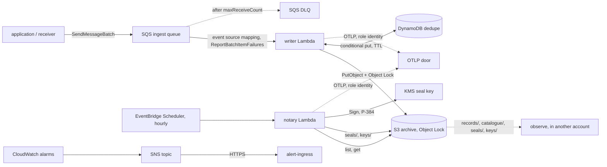

# AWS

The audit trail on AWS without Kubernetes: the writer and the notary as Lambda
functions, an SQS queue in front of the writer, an S3 bucket with Object Lock,
two KMS keys, and the alarms that say when any of it stops. All of it is built
by a Pulumi Go library, `github.com/truvity/audit/deploy/pulumi`, which is a
module of its own so that Pulumi is not in the root module's dependency graph.

**Nothing here is deployed by this repository.** The library is tested against
Pulumi's mocks (`just pulumi-test`): it declares the right resources with the
right arguments and creates none. The Lambda binaries are tested against fakes,
and the DynamoDB store against LocalStack. What has not happened is a run in an
account, which is why the [capabilities](../capabilities.md) page marks every AWS
row here 🧪 and not ✅.

## The shape



The two functions are the [two parts](../decisions/0016-three-parts-installed-independently.md)
that hold an identity each: the writer writes records and cannot sign, the notary
signs and cannot write a record. Observe is the third part and is not deployed
here; the library only creates the role it reads the bucket through.

### The writer

`cmd/audit-writer-lambda` is the writer of `audit-writer`, the package `writer`,
opened over the same archive with the same profiles and wrapped in the same
`require: archived` guard ([0017](../decisions/0017-sink-durability-and-transports.md)).
What changes is the shell:

- **Input.** An SQS event source mapping with partial batch responses
  (`ReportBatchItemFailures`). The handler decodes each message as a record,
  writes the batch as one call to the writer, and answers with the messages that
  were not archived, so that only they return to the queue.
  - the write succeeds: no failures, and the platform deletes the batch;
  - the write fails: every message that decoded is returned, and the writer's
    deduplication absorbs any of them that did land;
  - the sink refuses a record by id: that message is returned;
  - a message that is not a record: returned at once. It is a poison message and
    it reaches the DLQ after `MaxReceiveCount` deliveries, where an alarm is on
    it. Deleting it silently would be a record lost without anyone being told.
- **Deduplication.** Not Postgres: a function has no database. The `Dedupe` port
  of the writer has a second adapter, `dedupe/dynamodbdedupe`, with the semantics
  of a JetStream duplicate window and no more machinery than that. One item per
  written record id, `pk = DEDUPE#<id>`, with `expires_at` in epoch seconds.
  - Asking (`Seen`) is a consistent `BatchGetItem` and marks nothing. An expired
    item counts as absent even if DynamoDB has not deleted it yet, which it does
    lazily, up to two days late.
  - Marking is a conditional put per id, `attribute_not_exists(pk) OR
    expires_at < :now`, made only once the copies are durable. Two writers marking
    one id at once is not an error, and a repeat does not extend the window.
  - The order is the one the [Dedupe port](../decisions/0012-two-deliveries-and-a-durable-ack.md)
    has always had: a crash between the put and the mark costs a second copy of
    the record and never a hole.
  - The table's TTL attribute is `expires_at`, so it cleans itself.
  - The window is the widest any profile's presets ask for unless the
    configuration says (`dedupe.dynamodb.window`). It wants to be at least the
    queue's retention, which is 14 days at most.
- **Configuration.** One file in the function's package, `/var/task/audit.yaml`,
  validated against `schemas/config/audit-writer-lambda.schema.json`
  ([0021](../decisions/0021-one-validated-configuration-file.md)). The decision was
  between a file in the package and an environment that points at SSM. The file
  wins: ADR 0021 already says "the same file works on a function platform, where a
  file is in the image", it holds no secret, and everything it names (the bucket,
  the table, the key aliases) is known before the first resource exists, so the
  library renders it from the stack's own arguments and ships it in the zip. There
  is nothing to fetch at cold start, no IAM for SSM, and no second place to look.
  A change to the configuration is a new function version, which is the review
  unit it should be.
- **Legal holds.** The writer reads the holds every minute in a goroutine. A
  frozen environment does not run it, so the first write after a thaw could act
  on a list older than it looks. The handler re-reads the holds at the start of
  every invocation, and a refresh that fails keeps the last answer, as the
  background one does.
- **Telemetry.** `OTEL_*` only, to the extension's loopback proxy, flushed at the
  end of every invocation (the environment is frozen after it) and on SIGTERM.
- **Queue metrics.** The age of each message at receive, from `SentTimestamp`,
  as the histogram `audit.queue.message.age` (`audit_queue_message_age_seconds`)
  with the label `transport=sqs`. The depth, the oldest message and the DLQ are
  CloudWatch's and are [alarmed](#alarms).

Records on the queue were stamped by a receiver of the installation, which is the
only principal the queue's policy lets send, so the writer keeps the stamp they
carry (`FromStream`), as `audit-writer` does behind a stream.

### The notary

`cmd/audit-notary-lambda` runs `internal/cli.Notary`, the logic of `audit-notary`,
once per invocation. EventBridge Scheduler invokes it hourly (`cron(15 * * * ? *)`,
UTC, a quarter past, after the settle window of the hour that has just ended) and
does not retry: a run is idempotent, so the next run seals whatever is missing,
and a failed run is the Errors alarm's. It reads `audit-notary`'s own file
(`schemas/config/audit-notary.schema.json`) from the same place, with
`signer.kms` naming the seal key by alias. A run that could not seal a tenant
**fails the invocation**. The report is a log line, not standard output.

The notary records `audit.seal.written` only if the file's `sink` names a writer
the function can reach. A function outside a VPC cannot reach an in-cluster
writer, so on AWS the seals themselves, which are in the bucket and verifiable,
are the record, and `audit.seal.age` over OTLP says how far behind they are.

### Why a zip, and why no VPC

A **zip** on `provided.al2023`, `arm64`, and not a container image: the binaries
are static and a few MB, the configuration is one more file in the package, and
nothing here needs a registry. The release carries each function as a zip with
`bootstrap` at its root (`audit-writer-lambda_<version>_linux_arm64.zip`,
`audit-notary-lambda_<version>_linux_arm64.zip`), and the library builds the
package it ships from that binary plus the files it renders.

The functions run **outside a VPC** (decision P-INF-99). They reach S3, DynamoDB,
SQS, KMS and STS over the regional public endpoints with the role's credentials,
and the OTLP door over the internet. That is also why there is no NAT, no
interface endpoint, and no in-cluster writer for the notary to record through.

## The library

```go
import auditpulumi "github.com/truvity/audit/deploy/pulumi"

a, err := auditpulumi.New(ctx, "audit", &auditpulumi.Args{
	Archive: auditpulumi.ArchiveArgs{
		BucketName: "acme-audit-trial",
		Profiles:   []string{"security", "billing-nl"},
		// ObjectLockMode defaults to GOVERNANCE: the trial.
	},
	Ingest: auditpulumi.IngestArgs{
		Senders: []pulumi.StringInput{receiverRoleArn},
	},
	Writer: auditpulumi.WriterArgs{
		BinaryPath:     "dist/audit-writer-lambda/bootstrap",
		DeploymentYAML: deploymentYAML, // the profile configuration
	},
	Notary: auditpulumi.NotaryArgs{BinaryPath: "dist/audit-notary-lambda/bootstrap"},
	Telemetry: &auditpulumi.TelemetryArgs{
		ExtensionLayerArn: layerArn,
		IssuerURL:         "https://access.example.com",
		OTLPEndpoint:      "https://otlp.example.com",
	},
	Alerts:  auditpulumi.AlertsArgs{EndpointURL: pulumi.String("https://alerts.example.com/sns")},
	Observe: &auditpulumi.ObserveArgs{TrustedPrincipalArn: observeRoleArn},
})
```

`New` returns a component (`truvity:audit:Audit`) named for the installation. The
name is in every physical name, so one account may hold several installations.
It is 1 to 32 characters of `a-z`, `0-9` and `-`.

### Inputs

Required inputs are marked. Anything not listed has the default stated.

| input | default | meaning |
|---|---|---|
| `Tags` | none | on every resource that takes tags |
| `RolePath` | `/audit/` | the IAM path of every role the library creates |
| `LogRetentionDays` | 30 | each function's log group |
| `Archive.BucketName` | **required** | the bucket; it is in the functions' configuration, so it has to be known before anything is created |
| `Archive.ObjectLockMode` | `GOVERNANCE` | `GOVERNANCE` or `COMPLIANCE`, see [the switch](#governance-to-compliance) |
| `Archive.AcknowledgeCompliance` | false | the deliberate step before `COMPLIANCE`; without it the library builds nothing |
| `Archive.DefaultRetentionDays` | 0 | the bucket's default retention, a floor: the writer sets each object's own. 0 sets no default rule |
| `Archive.Profiles` | **required** | one lifecycle rule per `records/<profile>/` prefix |
| `Archive.GlacierIRDays`, `.DeepArchiveDays` | 30, 365 | [0023](../decisions/0023-archive-retention-and-lifecycle.md) |
| `Ingest.Senders` | none | principals allowed to send to the queue; none adds no sender statement, so only identity policies in the account grant sending |
| `Ingest.MaxReceiveCount` | 5 | deliveries before a message moves to the DLQ |
| `Ingest.RetentionDays` | 14 | the queue's retention; 14 is SQS's limit and the deduplication window's floor |
| `Writer.BinaryPath` | **required** | the linux/arm64 `bootstrap` |
| `Writer.DeploymentYAML` | **required** | the profile configuration, the document the chart renders |
| `Writer.Catalogues` | none | application catalogues by file name (`catalogue.yaml`, `catalogue-<name>.yaml`) |
| `Writer.Keys`, `.ForgetIdentities` | none | the `keys` block and `forgetIdentities` of the file |
| `Writer.DedupeWindow` | the profiles' widest | a Go duration |
| `Writer.MemoryMB`, `.TimeoutSeconds` | 512, 120 | |
| `Writer.BatchSize` | 10 | 1 to 10, the sink's limit |
| `Writer.MaxBatchingWindowSeconds` | 5 | how long the mapping gathers a batch: fewer, larger objects for a few seconds of latency |
| `Writer.MaxConcurrency` | 10 | the mapping's concurrency cap, 2 or more |
| `Notary.BinaryPath` | **required** | the linux/arm64 `bootstrap` |
| `Notary.Schedule` | `cron(15 * * * ? *)` | EventBridge Scheduler, UTC |
| `Notary.Profiles`, `.Settle` | every profile, `10m` | as `audit-notary` |
| `Notary.MemoryMB`, `.TimeoutSeconds` | 256, 900 | |
| `Telemetry` | nil | nil gives the functions no extension, no `OTEL_*` and no `sts:GetWebIdentityToken` |
| `Telemetry.ExtensionLayerArn` | **required** with `Telemetry` | the access-roster OTLP extension, published as a layer in the account and region |
| `Telemetry.IssuerURL`, `.OTLPEndpoint` | **required** with `Telemetry` | the issuer's base URL, and the OTLP/HTTP base URL (https) |
| `Telemetry.STSAudience`, `.OTLPAudience` | `otlp` | the audience asked of STS, which the roles' policies pin, and the exchange's audience |
| `Telemetry.ExtraEnv` | none | other `OTEL_*` variables |
| `Alerts.EndpointURL` | none | the HTTPS endpoint of alert-ingress; none creates the topic and the alarms and no subscription |
| `Alerts.OldestMessageAgeSeconds` | 900 | |
| `Alerts.NotarySilenceHours` | 3 | |
| `Observe.TrustedPrincipalArn` | **required** with `Observe` | the principal that may assume the read role |
| `Observe.ExternalID` | none | required of the assuming principal when set |

### Outputs

| output | what |
|---|---|
| `BucketName`, `BucketArn` | the archive |
| `ArchiveKeyArn` | the symmetric key objects are encrypted with (rotation on) |
| `SealKeyArn`, `SealKeyAlias` | the `ECC_NIST_P384` `SIGN_VERIFY` key and its alias, `alias/<name>-seal`. `audit key public` reads its public half for `keys/roots.jwks` and the verifier's pin |
| `QueueURL`, `QueueArn` | the ingest queue a receiver or an application sends to (`forward.sqs.queueUrl`) |
| `DlqURL`, `DlqArn` | the dead-letter queue |
| `DedupeTableName` | the DynamoDB table |
| `WriterFunctionArn`, `NotaryFunctionArn` | the functions |
| `WriterRoleArn`, `NotaryRoleArn`, `ObserveReaderRoleArn` | the roles, see below; the last is empty without `Observe` |
| `AlarmTopicArn` | the SNS topic every alarm publishes to |
| `ScheduleArn` | the notary's schedule |

### What it creates

| resource | notes |
|---|---|
| S3 bucket | Object Lock on, versioning enabled, SSE-KMS under the archive key with bucket keys, all four public-access blocks, bucket-owner-enforced ownership, a policy that denies plain HTTP, a lifecycle rule per profile prefix and one that aborts incomplete multipart uploads after 7 days. `ForceDestroy` is never set |
| KMS archive key | symmetric, rotation on, alias `alias/<name>-archive` |
| KMS seal key | `ECC_NIST_P384`, `SIGN_VERIFY`, alias `alias/<name>-seal`, and a key policy of its own (below) |
| SQS ingest queue and DLQ | SSE-SQS, visibility timeout six times the writer's timeout, a redrive policy to the DLQ and a redrive-allow policy on the DLQ, a queue policy that denies plain HTTP and allows the named senders |
| DynamoDB table `<name>-dedupe` | on-demand, hash key `pk` (string), TTL on `expires_at` |
| Lambda `<name>-writer`, `<name>-notary` | `provided.al2023`, `arm64`, no VPC, a log group each, the extension layer when there is one |
| event source mapping | queue to writer, `ReportBatchItemFailures`, scaling capped by `Writer.MaxConcurrency` |
| EventBridge Scheduler `<name>-notary` | the schedule, a role of its own that may invoke only the notary, no retries, and no asynchronous retries on the function |
| IAM roles | below |
| CloudWatch alarms, SNS topic `<name>-alarms` | [below](#alarms) |

The library supports the `aws` partition and one region per stack.

## IAM roles

**One role per function, under the path `/audit/`**, named `<name>-<part>`. The
name is in the role because an IAM role name is unique across the account whatever
its path, and one account may hold several installations. For the default
installation, `audit`, the exact ARNs, which gitops grants and a roster group
matcher name, are

| role | ARN | runs as |
|---|---|---|
| writer | `arn:aws:iam::<account>:role/audit/audit-writer` | the writer function; the identity the OTLP door sees |
| notary | `arn:aws:iam::<account>:role/audit/audit-notary` | the notary function; the identity the OTLP door sees |
| observe reader | `arn:aws:iam::<account>:role/audit/audit-observe-reader` | assumed by observe in another account (only with `Observe`) |
| scheduler | `arn:aws:iam::<account>:role/audit/audit-scheduler` | EventBridge Scheduler, to invoke the notary and nothing else |

The kernel OTLP door's provisional single role, `role/audit/audit`, is not used:
the writer and the notary must not share a role, because whoever can write the
archive and can also sign for it can choose what to sign
([0019](../decisions/0019-seals.md)).

What each role may do, and nothing more:

| | writer | notary | observe reader |
|---|---|---|---|
| S3 put | `PutObject`, `PutObjectRetention`, `PutObjectLegalHold` on `records/`, `catalogue/`, `schema/`, `identity/`, `dlq/` | `PutObject`, `PutObjectRetention` on `seals/`, `keys/` | none |
| S3 read | `GetObject` on the same and `holds/`, `ListBucket` | `GetObject` on `records/`, `seals/`, `keys/`, `ListBucket` | `GetObject` on `records/`, `catalogue/`, `seals/`, `keys/`; `ListBucket` under those prefixes |
| KMS | `GenerateDataKey`, `Decrypt` on the archive key | the same, and `Sign`, `GetPublicKey`, `DescribeKey` on the **seal key** | `Decrypt` on the archive key |
| DynamoDB | `GetItem`, `BatchGetItem`, `PutItem` on the dedupe table | none | none |
| SQS | `ReceiveMessage`, `DeleteMessage`, `GetQueueAttributes`, `ChangeMessageVisibility` on the ingest queue | none | none |
| logs | its own log group | its own log group | none |
| STS | `GetWebIdentityToken` with `Telemetry` | the same | none |

`PutObjectRetention` and `PutObjectLegalHold` are listed beside `PutObject`
because S3 refuses a put that carries an Object Lock header unless the caller also
holds the matching permission. No role has a delete: nothing in the archive is
deleted by anything in this stack.

**The seal key has a policy of its own.** The default key policy hands a key to
IAM, so any principal in the account with a `kms:Sign` allow could sign seals.
This one does not: the account's root administers the key (create, describe,
enable, put policy, schedule deletion and so on) and **cannot use it**, and only
the notary's role may `Sign`, `GetPublicKey` and `DescribeKey`.

**The web identity statement** is, for both functions, with the audience the
`Telemetry` input names (default `otlp`):

```json
{
  "Effect": "Allow",
  "Action": "sts:GetWebIdentityToken",
  "Resource": "*",
  "Condition": {
    "ForAllValues:StringEquals": { "sts:IdentityTokenAudience": ["otlp"] },
    "StringEquals": { "sts:SigningAlgorithm": "ES384" },
    "NumericLessThanEquals": { "sts:DurationSeconds": "300" }
  }
}
```

`sts:IdentityTokenAudience` is a multi-valued key, so it needs
`ForAllValues:StringEquals`: a plain `StringEquals` is an implicit deny when the
request carries the audience as a list. `ForAllValues` also passes on an empty
set, which is safe here only because `Audience` is a required parameter of
`GetWebIdentityToken`. The algorithm and the lifetime are what the extension asks
for.

## Telemetry

With `Telemetry` the functions send OpenTelemetry to the OTLP door with the
**function role's identity and no secret**. The access-roster extension layer
asks STS for an identity token for the role, trades it at the access-roster issuer
(RFC 8693) for a short-lived token audienced `otlp`, and runs an OTLP/HTTP proxy
on `127.0.0.1:4318` that forwards every export with that token. The function's own
SDK needs no credential: the library sets

```
OTEL_EXPORTER_OTLP_ENDPOINT=http://127.0.0.1:4318
OTEL_EXPORTER_OTLP_PROTOCOL=http/protobuf
OTEL_SERVICE_NAME=audit-writer            # audit-notary for the notary
ACCESS_ROSTER_ISSUER, ACCESS_ROSTER_AUDIENCE, ACCESS_ROSTER_OTLP_ENDPOINT, ACCESS_ROSTER_OTLP_AUDIENCE
```

The layer is the access-roster release's
`access-roster-lambda-layer_<version>_linux_arm64.zip`, published by you as a layer
version in the account and region; its ARN is `Telemetry.ExtensionLayerArn`. Its
own page (access-roster, `docs/integrations/aws-lambda.md`) covers the extension,
including that the account must have outbound identity federation enabled, that
the roster must admit the two roles (a group matcher on
`arn:aws:iam::<account>:role/audit/audit-*`, or the two exact ARNs above), and that
the extension is fail-open: telemetry never blocks an invocation.

The function flushes its metrics at the end of every invocation and on SIGTERM, so
that nothing waits in an environment that is frozen.

## Alarms

CloudWatch alarms publish, on ALARM and on OK, to the SNS topic `<name>-alarms`,
which is subscribed to alert-ingress over HTTPS. This is the D13 set:

| alarm | metric | fires when | why |
|---|---|---|---|
| `<name>-writer-throttles` | `AWS/Lambda` `Throttles`, writer | any, in 5 minutes | the writer is not keeping up, or the account's concurrency is spent |
| `<name>-notary-throttles` | `AWS/Lambda` `Throttles`, notary | any, in 5 minutes | |
| `<name>-ingest-dlq-not-empty` | `AWS/SQS` `ApproximateNumberOfMessagesVisible`, DLQ | above 0 | a record was delivered `MaxReceiveCount` times and is not in the archive |
| `<name>-ingest-oldest-message-age` | `AWS/SQS` `ApproximateAgeOfOldestMessage`, ingest | above `Alerts.OldestMessageAgeSeconds` (900) | the writer is behind or not running |
| `<name>-writer-errors` | `AWS/Lambda` `Errors`, writer | any, in 5 minutes | an invocation failed |
| `<name>-notary-errors` | `AWS/Lambda` `Errors`, notary | any, in an hour | a tenant could not be sealed, or the signer failed |
| `<name>-notary-silent` | `AWS/Lambda` `Invocations`, notary | below 1 in each of the last `Alerts.NotarySilenceHours` (3) hours | the schedule or the function is gone, and the chain of seals is growing a gap |

"The function going silent" is the notary's, as an alarm on the platform's own
`Invocations` metric: Lambda publishes no datapoint for an hour with no
invocations, so missing data is treated as breaching, and a function that has
stopped is the one case an alarm that depends on the function's own telemetry
cannot see. The writer is quiet when nothing is written, so its silence is not
an alarm; the oldest-message-age alarm is what says it has stopped with work to
do.

**How alarms reach alert-ingress.** CloudWatch publishes to the topic, and the
topic delivers to `Alerts.EndpointURL` over HTTPS. The subscription is created with
`EndpointAutoConfirms` false: SNS POSTs a `SubscriptionConfirmation` to the URL and
the subscription stays pending until the endpoint follows its `SubscribeURL`, so
alert-ingress has to handle SNS's message types (`SubscriptionConfirmation`,
`Notification`, `UnsubscribeConfirmation`) and should verify the message
signature. The topic is not encrypted with a customer key, which CloudWatch could
not publish to without a key policy of its own: an alarm's body names a queue and
a function and carries no record.

## GOVERNANCE to COMPLIANCE

The mode is a parameter. **GOVERNANCE is first, for the trial; COMPLIANCE only
after sign-off** ([0023](../decisions/0023-archive-retention-and-lifecycle.md)).

- In GOVERNANCE a principal holding `s3:BypassGovernanceRetention` can shorten or
  remove a retention. No role in this stack holds it. It is a rehearsal for the
  retention values, the key layout and the lifecycle, not a destination.
- In COMPLIANCE **nobody can shorten or remove a retention, including the
  account's root**, until each object's retention date. A retention wrong in the
  long direction is paid for until it expires, and one set on the wrong bucket
  cannot be undone. **The switch is irreversible**, and it is a **new bucket**,
  not an edit of the trial one: an existing object keeps the mode it was written
  with whatever the bucket's rule says later.

The way across:

1. Run the installation with GOVERNANCE for as long as it takes to see the
   retentions, the keys and the lifecycle behave, and sign the retentions off.
2. Create a second installation (a new component name, and a new `BucketName`)
   with `ObjectLockMode: auditpulumi.Compliance` **and**
   `AcknowledgeCompliance: true`. Without the acknowledgement the library refuses
   to build anything, and says why. A COMPLIANCE bucket is created with Pulumi's
   `protect`, so a stack destroy refuses to delete it until the protection is
   lifted by hand (S3 would refuse anyway, once the first object is locked).
3. Point the receivers and observe at the new queue and bucket. The trial bucket
   is emptied, or kept until its own retentions lapse; the trial doubles the
   storage for its length.

The lock mode reaches both functions' configuration (`archive.lockMode`), so the
writer writes objects in the mode the bucket was built for, and refuses to start
when a profile's frameworks demand a stricter one
([0014](../decisions/0014-lock-modes-and-store-tiers.md)).

## Lifecycle

One rule per `records/<profile>/` prefix: Glacier Instant Retrieval at 30 days
(still readable by observe's reindex and by `audit verify` without a restore) and
Deep Archive at one year (for what nobody expects to read before retention ends;
reading it needs a restore, and `audit verify` over such a range says so first).
`seals/`, `keys/` and `catalogue/` are small, are read often, and have no rule.
Objects below the storage class's minimum billable size stay where they are, which
is S3's default.

## Observe in another account

With `Observe`, the library creates `<name>-observe-reader` in the archive's
account. It trusts `Observe.TrustedPrincipalArn` (in the kernel's account, the role
`audit-observe` runs as; add `ExternalID` to require `sts:ExternalId`) and may
list and get on `records/`, `catalogue/`, `seals/` and `keys/`, and decrypt under
the archive key, and nothing else. Observe assumes it and follows the bucket by
cursor ([0020](../decisions/0020-observe-follows-the-bucket.md)); everything
downstream of that, including the index, is in the other account. The principal's
own side needs `sts:AssumeRole` on the role's ARN.

## Building and testing

The two binaries are built by the release as zips; locally,

```
GOOS=linux GOARCH=arm64 CGO_ENABLED=0 GOEXPERIMENT=jsonv2 go build -trimpath -o dist/audit-writer-lambda/bootstrap ./cmd/audit-writer-lambda
GOOS=linux GOARCH=arm64 CGO_ENABLED=0 GOEXPERIMENT=jsonv2 go build -trimpath -o dist/audit-notary-lambda/bootstrap ./cmd/audit-notary-lambda
```

`just pulumi-test` runs the library's tests, with Pulumi's mocks: no cloud, no
credentials, no plugin. They hold the resources and arguments above, the role
names, every role's rights, the alarm set, and the configuration the library ships
in each package against the JSON Schema of the binary that reads it, so the library
cannot drift from the code it deploys. `just test-s3` runs the DynamoDB store
against LocalStack. The library does not import the root module, and the root does
not import the library.

## Not covered

- **A deployment.** Nothing here has run in an account.
- **The `lambda` sink** (a direct invocation of the writer function) is still
  designed ([capabilities](../capabilities.md)); the queue is the transport.
- **FIFO ingest.** The queue is a standard queue and deduplication is the writer's;
  a FIFO queue would also absorb a repeat inside its five-minute window, and is
  not what the library creates.
- **A signed delegation.** The notary signs with a root, as everywhere
  ([0019](../decisions/0019-seals.md)).
