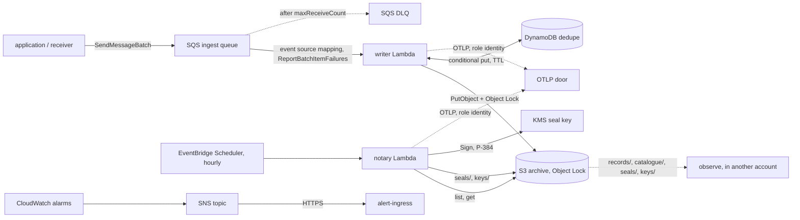

# AWS

The audit trail on AWS without Kubernetes: the writer and the notary as Lambda
functions, an SQS queue in front of the writer, an S3 bucket (with Object Lock, once it is turned on),
two KMS keys, and the alarms that say when any of it stops. All of it is built
by a Pulumi Go library, `github.com/truvity/audit/deploy/pulumi`, which is a
module of its own so that Pulumi is not in the root module's dependency graph.

**Nothing here is deployed by this repository.** The library is tested against
Pulumi's mocks (`just pulumi-test`): it declares the right resources with the
right arguments and creates none. The Lambda binaries are tested against fakes,
and the DynamoDB store against LocalStack. What has not happened is a run in an
account, which is why the [capabilities](../capabilities.md) page marks every AWS
row here 🧪 and not ✅.

## The shape



The two functions are the [two parts](../decisions/0016-three-parts-installed-independently.md)
that hold an identity each: the writer writes records and cannot sign, the notary
signs and cannot write a record. Observe is the third part and is not deployed
here; the library only creates the role it reads the bucket through.

### The writer

`cmd/audit-writer-lambda` is the writer of `audit-writer`, the package `writer`,
opened over the same archive with the same profiles and wrapped in the same
`require: archived` guard ([0017](../decisions/0017-sink-durability-and-transports.md)).
What changes is the shell:

- **Input.** An SQS event source mapping with partial batch responses
  (`ReportBatchItemFailures`). The handler decodes each message as a record,
  writes the batch as one call to the writer, and answers with the messages that
  were not archived, so that only they return to the queue.
  - the write succeeds: no failures, and the platform deletes the batch;
  - the write fails: every message that decoded is returned, and the writer's
    deduplication absorbs any of them that did land;
  - the sink refuses a record by id: that message is returned;
  - a message that is not a record: returned at once. It is a poison message and
    it reaches the DLQ after `MaxReceiveCount` deliveries, where an alarm is on
    it. Deleting it silently would be a record lost without anyone being told.
- **Deduplication.** Not Postgres: a function has no database. The `Dedupe` port
  of the writer has a second adapter, `dedupe/dynamodbdedupe`, with the semantics
  of a JetStream duplicate window and no more machinery than that. One item per
  written record id, `pk = DEDUPE#<id>`, with `expires_at` in epoch seconds.
  - Asking (`Seen`) is a consistent `BatchGetItem` and marks nothing. An expired
    item counts as absent even if DynamoDB has not deleted it yet, which it does
    lazily, up to two days late.
  - Marking is a conditional put per id, `attribute_not_exists(pk) OR
    expires_at < :now`, made only once the copies are durable. Two writers marking
    one id at once is not an error, and a repeat does not extend the window.
  - The order is the one the [Dedupe port](../decisions/0012-two-deliveries-and-a-durable-ack.md)
    has always had: a crash between the put and the mark costs a second copy of
    the record and never a hole.
  - The table's TTL attribute is `expires_at`, so it cleans itself.
  - The window is the widest any profile's presets ask for unless the
    configuration says (`dedupe.dynamodb.window`). It wants to be at least the
    queue's retention, which is 14 days at most.
- **Configuration.** One file, `/opt/audit/audit.yaml`, in an immutable layer
  version of its own, validated against
  `schemas/config/audit-writer-lambda.schema.json`
  ([0021](../decisions/0021-one-validated-configuration-file.md)). The function
  finds it through `AUDIT_CONFIG=/opt/audit/audit.yaml`, which the library sets
  and which is also the binary's default. Beside it the layer holds the profile
  document (`deployment.yaml`) and the catalogues (`catalogues/`), so the three
  things that decide what the writer keeps and how it reads a record travel
  together. See [configuration as a layer](#configuration-as-a-layer).
- **Legal holds.** The writer reads the holds every minute in a goroutine. A
  frozen environment does not run it, so the first write after a thaw could act
  on a list older than it looks. The handler re-reads the holds at the start of
  every invocation, and a refresh that fails keeps the last answer, as the
  background one does.
- **Telemetry.** `OTEL_*` only, to the extension's loopback proxy, flushed at the
  end of every invocation (the environment is frozen after it) and on SIGTERM.
- **Queue metrics.** The age of each message at receive, from `SentTimestamp`,
  as the histogram `audit.queue.message.age` (`audit_queue_message_age_seconds`)
  with the label `transport=sqs`. The depth, the oldest message and the DLQ are
  CloudWatch's and are [alarmed](#alarms).

Records on the queue were stamped by a receiver of the installation, which is the
only principal the queue's policy lets send, so the writer keeps the stamp they
carry (`FromStream`), as `audit-writer` does behind a stream.

### The notary

`cmd/audit-notary-lambda` runs `internal/cli.Notary`, the logic of `audit-notary`,
once per invocation. EventBridge Scheduler invokes it hourly (`cron(15 * * * ? *)`,
UTC, a quarter past, after the settle window of the hour that has just ended) and
does not retry: a run is idempotent, so the next run seals whatever is missing,
and a failed run is the Errors alarm's. It reads `audit-notary`'s own file
(`schemas/config/audit-notary.schema.json`) from the same place, with
`signer.kms` naming the seal key by alias. A run that could not seal a tenant
**fails the invocation**. The report is a log line, not standard output.

The notary records `audit.seal.written` only if the file's `sink` names a writer
the function can reach. A function outside a VPC cannot reach an in-cluster
writer, so on AWS the seals themselves, which are in the bucket and verifiable,
are the record, and `audit.seal.age` over OTLP says how far behind they are.

### Why a zip, and why no VPC

A **zip** on `provided.al2023`, `arm64`, and not a container image: the binaries
are static and a few MB and nothing here needs a registry. The release carries
each function as a zip with `bootstrap` at its root
(`audit-writer-lambda_<version>_linux_arm64.zip`,
`audit-notary-lambda_<version>_linux_arm64.zip`), and the library deploys **that
file, byte for byte**: it adds nothing to it and builds no package of its own. You
give it the zip and the SHA-256 the release's `checksums.txt` lists for it
(`Writer.Package`, `Writer.PackageSHA256`), and it is read, hashed and refused when
it is not that file. The configuration is a layer beside it.

The functions run **outside a VPC** (a decision of the AWS design). They reach S3, DynamoDB,
SQS, KMS and STS over the regional public endpoints with the role's credentials,
and the OTLP door over the internet. That is also why there is no NAT, no
interface endpoint, and no in-cluster writer for the notary to record through.

## The library

```go
import auditpulumi "github.com/truvity/audit/deploy/pulumi"

a, err := auditpulumi.New(ctx, "audit", &auditpulumi.Args{
	Archive: auditpulumi.ArchiveArgs{
		BucketName: "acme-audit-trial",
		Profiles:   []string{"security", "billing-nl"},
		// ObjectLockMode is required: NONE, GOVERNANCE or COMPLIANCE.
		// A trial bucket starts with NONE and gets the lock later.
		ObjectLockMode: auditpulumi.None,
	},
	Ingest: auditpulumi.IngestArgs{
		Senders: []pulumi.StringInput{receiverRoleArn},
	},
	Writer: auditpulumi.WriterArgs{
		// The release's zip and the digest its checksums.txt lists for it.
		Package:        "dist/audit-writer-lambda_0.11.0_linux_arm64.zip",
		PackageSHA256:  writerSHA,
		DeploymentYAML: deploymentYAML, // the profile configuration
	},
	Notary: auditpulumi.NotaryArgs{
		Package:       "dist/audit-notary-lambda_0.11.0_linux_arm64.zip",
		PackageSHA256: notarySHA,
	},
	Telemetry: &auditpulumi.TelemetryArgs{
		ExtensionLayerArn: layerArn,
		IssuerURL:         "https://access.example.com",
		OTLPEndpoint:      "https://otlp.example.com",
	},
	Alerts:  auditpulumi.AlertsArgs{EndpointURL: pulumi.String("https://alerts.example.com/sns")},
	Observe: &auditpulumi.ObserveArgs{TrustedPrincipalArn: observeRoleArn},
})
```

`New` returns a component (`truvity:audit:Audit`) named for the installation. The
name is in every physical name, so one account may hold several installations.
It is 1 to 32 characters of `a-z`, `0-9` and `-`.

### Configuration as a layer

The rendered `audit.yaml`, the profile document and the catalogues are published as
an `aws.lambda.LayerVersion` named `<name>-writer-config` (and `<name>-notary-config`,
which holds `audit.yaml` alone), whose zip holds them under `audit/` so that Lambda
extracts them to `/opt/audit/`. The function's `Layers` are that layer and, with
`Telemetry`, the extension: two of the five a function may have. Its environment is
`AUDIT_CONFIG=/opt/audit/audit.yaml`, `AUDIT_CONFIG_LAYER=<the layer version's ARN>`
and the telemetry's `OTEL_*`.

The alternative was a pointer: the function's environment names an SSM parameter or
an S3 object that holds the configuration, read at cold start. A layer wins on the
properties that matter to an audit trail. **It is immutable**: a layer version
cannot be edited, so what ran is what was published, and a change is a new version
that the function is pointed at in the same `pulumi up` that is reviewed. **It is
versioned and kept**: the library does not delete an old version when a new one
replaces it (`SkipDestroy`), so a rollback, and an older function version, find the
configuration they ran with. **It has no moving part at start**: nothing is fetched,
there is no IAM for SSM or for a second bucket, and a cold start cannot fail because
a parameter store is unreachable. And **the function and its configuration are two
things with two versions**: a new release of the binary with the same configuration
is a code update, and an edited catalogue with the same binary is a layer update.
The pointer's one advantage, changing the configuration without a deploy, is the
one an audit trail should not have.

The writer says which configuration it ran under in its start-up record
(`audit.writer.started`): the digest of the file, of the profile document and of the
catalogues, and the layer version's ARN
([configuration](../reference/configuration.md#the-configuration-file)).
The platform does not tell a function which layers it has, so the ARN is what the
library puts in `AUDIT_CONFIG_LAYER`.

### Guards before the function is updated

A function that fails its init is not a failed deploy. The event source mapping
keeps invoking it, every invocation fails, and the ingest queue drains into the
dead-letter queue a message at a time. So what can be known before the function is
touched is checked in the program, ahead of every resource, and a failure is a
failed `pulumi preview`:

- **The package** is the file the digest names, a zip with `bootstrap` at its root
  and nothing outside it, an arm64 Linux executable, built from the command the
  field wants (the notary's zip is not accepted as the writer's).
- **The library's release and the binary's** are the same. The library renders the
  configuration for its own release's schema, and a binary of another may refuse it
  at start-up. The binary's release is the one in the zip's file name, which is the
  name the digest was listed under in `checksums.txt` (the release builds with
  `-s -w`, which leaves the stamp out of the binary's build information).
  `Guards.AllowVersionSkew` accepts a difference that is meant: a build from a
  checkout, or a zip with another name. A library whose own release is not known (a
  `replace` directive) compares nothing.
- **Each catalogue** is compared with the archive's own copy at
  `catalogue/<source>/<version>`: a changed document under an unchanged version is
  what the writer refuses to start on, and is refused here instead. An object that
  is not there, or a bucket that is not there yet, is nothing to compare; anything
  else that stops the comparison is a refusal. The deploying identity needs
  `s3:GetObject` on `catalogue/*`; `Guards.SkipCatalogueCheck` says it cannot.

### The AWS provider

The library makes one invoke, `aws.GetCallerIdentity`, for the account the seal
key's policy names. It is made **through the component**, so it uses the provider
the caller gave `New`, and not the default one, which a stack may have disabled
(`pulumi:disable-default-providers`, as the truvity gitops stacks do):

```go
prov, _ := aws.NewProvider(ctx, "audit-account", &aws.ProviderArgs{Region: pulumi.String("eu-west-1")})
a, err := auditpulumi.New(ctx, "audit", args, pulumi.Provider(prov)) // or pulumi.Providers(prov)
```

Every resource the library creates is a child of the component and takes the
provider the same way. A caller that would rather not make the call, or has no
way to, sets `Args.AccountID` and no invoke is made. No invoke is made either
when the notary is off, since the account is used for nothing else. The tests
check on Pulumi's mocks that the provider reaches the invoke.

### Optional parts

The archive is the one part that is always there. The ingest side and the notary
are each optional, and independent of the other:

| | `Ingest.Disabled` | `Notary.Disabled` | both |
|---|---|---|---|
| left out | queue and DLQ, DynamoDB table, writer function, role, log group and event source mapping, the writer's and the queue's alarms (4) | seal key and alias, notary function, role and log group, the schedule and the scheduler's role, the notary's alarms (3) | all of it |
| outputs that are then empty | `QueueURL`, `QueueArn`, `DlqURL`, `DlqArn`, `DedupeTableName`, `WriterFunctionArn`, `WriterRoleArn` | `SealKeyArn`, `SealKeyAlias`, `NotaryFunctionArn`, `NotaryRoleArn`, `ScheduleArn` | and `AlarmTopicArn` |
| inputs no longer required | `Writer.Package`, `Writer.PackageSHA256`, `Writer.DeploymentYAML` | `Notary.Package`, `Notary.PackageSHA256` | |

The alarm topic exists when at least one alarm does. The resource counts the
tests hold, with the component itself, for the test installation (Governance,
telemetry, alerts, observe): both parts 44, ingest only 30, notary only 29,
neither 13.

Use ingest without the notary where the seals are made elsewhere (a notary on
Talos signing with OpenBao transit), and neither where both are deferred: the
archive, its key and the roles for what reads it are then all the stack holds.
A part turned off later is a plain removal: its resources are deleted by the next
`pulumi up`, except the seal key and the bucket, which are protected and make the
update stop until the protection is lifted by hand.

### Encryption

`Archive.Encryption` has three modes, and `Archive.KeyArn` refines the first:

| Mode | Bucket default encryption | Key | Role grants | `kmsKey` in the functions' configuration | `ArchiveKeyArn` |
|---|---|---|---|---|---|
| `kms` (default, what every earlier version did) | SSE-KMS, bucket keys on | the library creates `alias/<name>-archive` (rotation on, protected) | `kms:GenerateDataKey`, `kms:Decrypt` on it (the read role: `Decrypt`) | the alias | the created key |
| `kms` with `KeyArn` | SSE-KMS under `KeyArn`, bucket keys on | yours: none is created | the same grants, on `KeyArn` | `KeyArn` | `KeyArn` |
| `aws-managed` | SSE-KMS under the AWS-managed key `aws/s3`, bucket keys on | none is created | none | none: the bucket default applies | empty |
| `s3` | SSE-S3 (`AES256`) | none | none | none | empty |

`KeyArn` is refused with `aws-managed` and `s3`, and must be a key ARN
(`arn:<partition>:kms:<region>:<account>:key/<id>`), not an alias ARN, which IAM
cannot grant on. The seal key is a different key and never changes: the notary
still signs with it. Objects already written keep the encryption they were
written with.

**A key you bring.** The roles are granted the key through their IAM policies,
so the key's own policy must let IAM grant access: the default key policy's
`arn:aws:iam::<account>:root` statement does that, and a policy without it makes
every put and get fail with `AccessDenied` however the roles are written. The
library neither edits nor protects a key it did not create; its rotation, its
deletion window and its policy stay yours. For a key in another account, the
key policy there must also name the roles.

**The AWS-managed key.** No grant on a key is needed or made. S3 uses `aws/s3`
on behalf of the caller and decrypts for any principal in the account that holds
`s3:GetObject` on the object, so the bucket's IAM and bucket policy are the only
access control over plaintext; the key policy cannot be changed and cannot add a
second control. Its use is logged in CloudTrail under the account, not under a
key of its own.

**What SSE-S3 gives up** is the key policy and the CloudTrail record of every
use that either KMS mode has.

**ISO 27001 (A.8.24, use of cryptography).** The control asks for a documented
policy on cryptography and key management, not for a customer-managed key.
AWS-managed keys are acceptable when the policy says so and records who rotates
(AWS, yearly), who can use the key and how its use is evidenced. Choose a
customer key (`kms`, with or without `KeyArn`) when the ISMS policy or a
customer contract requires control of the key: its policy, rotation, a
separate-duties split between key administrators and users, or the ability to
disable it. Use `KeyArn` when the organisation already manages keys centrally.

**Switching an existing deployment from `kms` to `aws-managed` (or `s3`).**
Changing the field changes only the bucket's default for objects written from
then on: S3 does not re-encrypt existing objects, and they still need the old
key to be read. The roles also lose their grant on the old key, so they cannot
read the old objects either, and the old archive key (protected, and no longer
managed by the stack) must not be removed yet. Sequence it:

1. Before applying, preview the change: it updates the bucket's default
   encryption and drops the roles' grants on the old key. Keep a principal of
   your own that can use the old key, for the copy.
2. Apply, then copy each object over itself so it is rewritten under the new
   default: S3 Batch Operations "Copy" for a large bucket, or `aws s3 cp
   s3://<bucket>/<prefix>/ s3://<bucket>/<prefix>/ --recursive --sse aws:kms
   --metadata-directive REPLACE` per prefix (S3 refuses a copy onto itself that
   changes nothing, and `REPLACE` drops user metadata unless it is restated).
   A copy makes a new version, and the old versions, with their Object Lock
   retention, stay under the old key until they expire, so the old key must
   outlive the longest retention of the old versions. Set the new versions'
   retention to match, so nothing is shortened.
3. Verify with `aws s3api head-object` that the current versions report
   `ServerSideEncryption: aws:kms` and no `SSEKMSKeyId` of the old key, then run
   `audit verify`.
4. Only then schedule the old key's deletion (a 30-day window), and only after
   every version that it encrypted has expired or been rewritten. Deleting it
   earlier makes those objects permanently unreadable.

### The application's catalogue

The writer function has no registry: it registers the common catalogue and the
files in `catalogues/` of its package, and nothing else, so an application's
catalogue reaches it only through the Pulumi program that deploys it. The
application (sluis, whose source name is `roster`) hands over its catalogue
document, from the file its release ships or from a string:

```go
Writer: auditpulumi.WriterArgs{
	// ...
	CataloguePaths: []string{"catalogue/catalogue-roster.yaml"},
	// or Catalogues: map[string]string{"catalogue-roster.yaml": roster},
},
```

File names are `catalogue.yaml` or `catalogue-<name>.yaml`; a name given both ways
with different content, an unreadable path and an empty file are refused before
anything is created. The files go into the configuration layer beside `audit.yaml`,
so **a change to a catalogue is a new layer version, and `pulumi up` points the
writer at it**. Nothing reaches the writer between deploys, which is the point:
a release of an application that changed its catalogue under an unchanged version
once crash-looped the application, and a catalogue change should be a deliberate,
reviewed deploy of this stack, with the new catalogue visible in the preview. Bump
the catalogue's version when its content changes: a changed document under an
unchanged version is refused in the preview, against the archive's own copy (see
[guards](#guards-before-the-function-is-updated)). Keep the copy the stack reads in
step with the application's release (pin it to the same tag, or vendor it).

### Kubernetes workloads (IRSA)

A cluster that is not EKS (Talos) can have an IAM OIDC provider of its own, and a
ServiceAccount's projected token can then assume a role by web identity. Two roles
accept this, each for **one** ServiceAccount:

```go
Observe: &auditpulumi.ObserveArgs{
	IRSA: &auditpulumi.IRSAArgs{
		OIDCProviderArn: oidcProviderArn,        // arn:aws:iam::<account>:oidc-provider/k8s.example.test
		IssuerHost:      "k8s.example.test",    // the provider's URL, no scheme
		Namespace:       "audit",
		ServiceAccount:  "audit-observe",
		// Audience defaults to "sts.amazonaws.com"
	},
},
```

The trust policy is

```json
{
  "Effect": "Allow",
  "Principal": { "Federated": "<OIDCProviderArn>" },
  "Action": "sts:AssumeRoleWithWebIdentity",
  "Condition": { "StringEquals": {
    "<IssuerHost>:aud": "sts.amazonaws.com",
    "<IssuerHost>:sub": "system:serviceaccount:<Namespace>:<ServiceAccount>"
  } }
}
```

Both conditions matter: without the `sub` pin any ServiceAccount of the cluster
could assume the role, and without the `aud` pin a token minted for another
audience would be accepted. The library refuses an empty namespace or
ServiceAccount, and a name with a wildcard in it. The ServiceAccount's token must
be projected with the audience, and the workload set `AWS_ROLE_ARN` and
`AWS_WEB_IDENTITY_TOKEN_FILE` (the AWS SDK's own web identity provider).

- **`Observe.IRSA`** makes `<name>-observe-reader` trust the ServiceAccount. It is an
  alternative to `Observe.TrustedPrincipalArn`, or in addition to it (the role
  then has both statements). The role is read only: `GetObject` on `records/`,
  `catalogue/`, `schema/`, `seals/` and `keys/`, `ListBucket` under those prefixes,
  and `kms:Decrypt` on the archive key when there is one.
- **`ArchiveWriter`** creates `<name>-archive-writer` for a workload outside AWS
  that writes part of the archive itself: hive runs the digest on Talos, and it
  writes `seals/` and `keys/`. `ArchiveWriter.IRSA` is the same block;
  `ArchiveWriter.Prefixes` are what it may put under (any of `records/`,
  `catalogue/`, `schema/`, `identity/`, `dlq/`, `seals/`, `keys/`; default `seals/` and
  `keys/`). Its rights are `PutObject` on those prefixes (and `PutObjectRetention`
  unless the mode is `NONE`), `GetObject` on `records/` and those prefixes,
  `ListBucket`, and the archive key's `GenerateDataKey` and `Decrypt` when there is
  one. It has no delete, no legal hold, no seal key, no queue and no table.

Output: `ArchiveWriterRoleArn`, empty without `ArchiveWriter`.

### Inputs

Required inputs are marked. Anything not listed has the default stated.

| input | default | meaning |
|---|---|---|
| `Tags` | none | on every resource that takes tags |
| `AccountID` | looked up | the account; empty looks it up through the component's provider, see [the AWS provider](#the-aws-provider) |
| `RolePath` | `/audit/` | the IAM path of every role the library creates |
| `LogRetentionDays` | 30 | each function's log group |
| `Archive.BucketName` | **required** | the bucket; it is in the functions' configuration, so it has to be known before anything is created |
| `Archive.ObjectLockMode` | **required** | `NONE`, `GOVERNANCE` or `COMPLIANCE`; there is no default, so every caller chooses. See [the lock modes](#the-lock-modes) |
| `Archive.AcknowledgeCompliance` | false | the deliberate step before `COMPLIANCE`; without it the library builds nothing |
| `Archive.DefaultRetentionDays` | 0 | the bucket's default retention, a floor: the writer sets each object's own. 0 sets no default rule; refused with `NONE` |
| `Archive.Encryption` | `kms` | `kms` (SSE-KMS under an archive key), `aws-managed` (SSE-KMS under `aws/s3`) or `s3` (SSE-S3); the last two create no key and grant no `kms` on one; see [encryption](#encryption) |
| `Archive.KeyArn` | empty | an existing KMS key ARN for `Encryption: kms`: no key is created and the roles are granted it; refused with the other modes |
| `Archive.Profiles` | **required** | one lifecycle rule per `records/<profile>/` prefix |
| `Archive.GlacierIRDays`, `.DeepArchiveDays` | 30, 365 | [0023](../decisions/0023-archive-retention-and-lifecycle.md) |
| `Ingest.Disabled` | false | leaves out the queue, the table, the writer and their alarms; see [optional parts](#optional-parts) |
| `Ingest.Senders` | none | principals allowed to send to the queue; none adds no sender statement, so only identity policies in the account grant sending |
| `Ingest.MaxReceiveCount` | 5 | deliveries before a message moves to the DLQ |
| `Ingest.RetentionDays` | 14 | the queue's retention; 14 is SQS's limit and the deduplication window's floor |
| `Writer.Package` | **required** unless `Ingest.Disabled` | the release's `audit-writer-lambda_<version>_linux_arm64.zip`, a path or an https URL; the function's code as released |
| `Writer.PackageSHA256` | **required** with the package | that zip's SHA-256 in hex, from the release's `checksums.txt` |
| `Writer.DeploymentYAML` | **required** unless `Ingest.Disabled` | the profile configuration, the document the chart renders |
| `Writer.Catalogues` | none | application catalogues by file name (`catalogue.yaml`, `catalogue-<name>.yaml`) and content; see [the application's catalogue](#the-applications-catalogue) |
| `Writer.CataloguePaths` | none | the same, read from files on disk under their base names; merged with `Catalogues` |
| `Writer.Keys`, `.ForgetIdentities` | none | the `keys` block and `forgetIdentities` of the file |
| `Writer.DedupeWindow` | the profiles' widest | a Go duration |
| `Writer.MemoryMB`, `.TimeoutSeconds` | 512, 120 | |
| `Writer.BatchSize` | 10 | 1 to 10, the sink's limit |
| `Writer.MaxBatchingWindowSeconds` | 5 | how long the mapping gathers a batch: fewer, larger objects for a few seconds of latency |
| `Writer.MaxConcurrency` | 10 | the mapping's concurrency cap, 2 or more |
| `Notary.Disabled` | false | leaves out the seal key, the notary, its schedule and alarms |
| `Notary.Package` | **required** unless `Notary.Disabled` | the release's `audit-notary-lambda_<version>_linux_arm64.zip` |
| `Notary.PackageSHA256` | **required** with the package | its SHA-256 in hex |
| `Guards.AllowVersionSkew`, `.SkipCatalogueCheck` | false | acknowledge a binary of another release than the library, and skip the comparison of catalogues with the archive; see [guards](#guards-before-the-function-is-updated) |
| `Notary.Schedule` | `cron(15 * * * ? *)` | EventBridge Scheduler, UTC |
| `Notary.Profiles`, `.Settle` | every profile, `10m` | as `audit-notary` |
| `Notary.MemoryMB`, `.TimeoutSeconds` | 256, 900 | |
| `Telemetry` | nil | nil gives the functions no extension, no `OTEL_*` and no `sts:GetWebIdentityToken` |
| `Telemetry.ExtensionLayerArn` | **required** with `Telemetry` | the access-roster OTLP extension, published as a layer in the account and region |
| `Telemetry.IssuerURL`, `.OTLPEndpoint` | **required** with `Telemetry` | the issuer's base URL, and the OTLP/HTTP base URL (https) |
| `Telemetry.STSAudience`, `.OTLPAudience` | `otlp` | the audience asked of STS, which the roles' policies pin, and the exchange's audience |
| `Telemetry.ExtraEnv` | none | other `OTEL_*` variables |
| `Alerts.EndpointURL` | none | the HTTPS endpoint of alert-ingress; none creates the topic and the alarms and no subscription |
| `Alerts.OldestMessageAgeSeconds` | 900 | |
| `Alerts.NotarySilenceHours` | 3 | |
| `Observe.TrustedPrincipalArn` | one of this and `IRSA` is **required** with `Observe` | the principal that may assume the read role |
| `Observe.ExternalID` | none | required of the assuming principal when set; does not apply to IRSA |
| `Observe.IRSA` | none | a ServiceAccount that may assume the read role by web identity, see [IRSA](#kubernetes-workloads-irsa) |
| `ArchiveWriter` | nil | `IRSA` (the same block) and `Prefixes` (default `seals/`, `keys/`): a write role for a workload outside AWS |

### Outputs

| output | what |
|---|---|
| `BucketName`, `BucketArn` | the archive |
| `ArchiveKeyArn` | the symmetric key objects are encrypted with (rotation on); the given `Archive.KeyArn` if set; empty with `Encryption: s3` or `aws-managed` |
| `SealKeyArn`, `SealKeyAlias` | the `ECC_NIST_P384` `SIGN_VERIFY` key and its alias, `alias/<name>-seal`. `audit key public` reads its public half for `keys/roots.jwks` and the verifier's pin |
| `QueueURL`, `QueueArn` | the ingest queue a receiver or an application sends to (`forward.sqs.queueUrl`), and what the chart's `sink.sqs` of the query service and the jobs names when the writer runs here ([observe and query in Kubernetes](#observe-and-query-in-kubernetes-writer-on-lambda)): `QueueURL` is the `queueUrl`, `QueueArn` the resource of `sqs:SendMessage` |
| `DlqURL`, `DlqArn` | the dead-letter queue |
| `DedupeTableName` | the DynamoDB table |
| `WriterFunctionArn`, `NotaryFunctionArn` | the functions |
| `WriterRoleArn`, `NotaryRoleArn`, `ObserveReaderRoleArn` | the roles, see below; `ObserveReaderRoleArn` is empty without `Observe`; the outputs of a part that is turned off are empty too |
| `ArchiveWriterRoleArn` | the IRSA write role, empty without `ArchiveWriter` |
| `AlarmTopicArn` | the SNS topic every alarm publishes to |
| `ScheduleArn` | the notary's schedule |

### What it creates

| resource | notes |
|---|---|
| S3 bucket | versioning enabled in every mode, protected from a stack destroy in every mode, the bucket's own `objectLockEnabled` never set (it forces replacement), and Object Lock as a separate configuration resource that exists unless the mode is `NONE`; SSE-KMS under the archive key with bucket keys (the AWS-managed key with `aws-managed`, SSE-S3 with `s3`), all four public-access blocks, bucket-owner-enforced ownership, a policy that denies plain HTTP, a lifecycle rule per profile prefix and one that aborts incomplete multipart uploads after 7 days. `ForceDestroy` is never set |
| KMS archive key | symmetric, rotation on, protected, alias `alias/<name>-archive`; only with `Encryption: kms` and no `KeyArn` |
| KMS seal key | `ECC_NIST_P384`, `SIGN_VERIFY`, protected, alias `alias/<name>-seal`, and a key policy of its own (below) |
| SQS ingest queue and DLQ | SSE-SQS, visibility timeout six times the writer's timeout, a redrive policy to the DLQ and a redrive-allow policy on the DLQ, a queue policy that denies plain HTTP and allows the named senders |
| DynamoDB table `<name>-dedupe` | on-demand, hash key `pk` (string), TTL on `expires_at` |
| Lambda `<name>-writer`, `<name>-notary` | `provided.al2023`, `arm64`, no VPC, a log group each, the extension layer when there is one |
| event source mapping | queue to writer, `ReportBatchItemFailures`, scaling capped by `Writer.MaxConcurrency` |
| EventBridge Scheduler `<name>-notary` | the schedule, a role of its own that may invoke only the notary, no retries, and no asynchronous retries on the function |
| IAM roles | below |
| CloudWatch alarms, SNS topic `<name>-alarms` | [below](#alarms) |

The library supports the `aws` partition and one region per stack.

## IAM roles

**One role per function, under the path `/audit/`**, named `<name>-<part>`. The
name is in the role because an IAM role name is unique across the account whatever
its path, and one account may hold several installations. For the default
installation, `audit`, the exact ARNs, which gitops grants and a roster group
matcher name, are

| role | ARN | runs as |
|---|---|---|
| writer | `arn:aws:iam::<account>:role/audit/audit-writer` | the writer function; the identity the OTLP door sees |
| notary | `arn:aws:iam::<account>:role/audit/audit-notary` | the notary function; the identity the OTLP door sees |
| observe reader | `arn:aws:iam::<account>:role/audit/audit-observe-reader` | assumed by observe in another account or by a Kubernetes ServiceAccount (only with `Observe`) |
| archive writer | `arn:aws:iam::<account>:role/audit/audit-archive-writer` | a Kubernetes ServiceAccount, by IRSA (only with `ArchiveWriter`) |
| scheduler | `arn:aws:iam::<account>:role/audit/audit-scheduler` | EventBridge Scheduler, to invoke the notary and nothing else |

The writer, notary and scheduler roles exist only with their part; the KMS
row is empty with `Encryption: s3` or `aws-managed`, and the IRSA write role is described under
[Kubernetes workloads](#kubernetes-workloads-irsa).

The kernel OTLP door's provisional single role, `role/audit/audit`, is not used:
the writer and the notary must not share a role, because whoever can write the
archive and can also sign for it can choose what to sign
([0019](../decisions/0019-seals.md)).

What each role may do, and nothing more:

| | writer | notary | observe reader |
|---|---|---|---|
| S3 put | `PutObject`, `PutObjectRetention`, `PutObjectLegalHold` on `records/`, `catalogue/`, `schema/`, `identity/`, `dlq/` | `PutObject`, `PutObjectRetention` on `seals/`, `keys/` | none |
| S3 read | `GetObject` on the same and `holds/`, `ListBucket` | `GetObject` on `records/`, `seals/`, `keys/`, `ListBucket` | `GetObject` on `records/`, `catalogue/`, `schema/`, `seals/`, `keys/`; `ListBucket` under those prefixes |
| KMS | `GenerateDataKey`, `Decrypt` on the archive key | the same, and `Sign`, `GetPublicKey`, `DescribeKey` on the **seal key** | `Decrypt` on the archive key |
| DynamoDB | `GetItem`, `BatchGetItem`, `PutItem` on the dedupe table | none | none |
| SQS | `ReceiveMessage`, `DeleteMessage`, `GetQueueAttributes`, `ChangeMessageVisibility` on the ingest queue | none | none |
| logs | its own log group | its own log group | none |
| STS | `GetWebIdentityToken` with `Telemetry` | the same | none |

`PutObjectRetention` and `PutObjectLegalHold` are listed beside `PutObject`
because S3 refuses a put that carries an Object Lock header unless the caller also
holds the matching permission. With `ObjectLockMode: NONE` the functions send no
lock header, so both grants are left out. No role has a delete: nothing in the archive is
deleted by anything in this stack.

**The seal key has a policy of its own.** The default key policy hands a key to
IAM, so any principal in the account with a `kms:Sign` allow could sign seals.
This one does not: the account's root administers the key (create, describe,
enable, put policy, schedule deletion and so on) and **cannot use it**, and only
the notary's role may `Sign`, `GetPublicKey` and `DescribeKey`.

**The web identity statement** is, for both functions, with the audience the
`Telemetry` input names (default `otlp`):

```json
{
  "Effect": "Allow",
  "Action": "sts:GetWebIdentityToken",
  "Resource": "*",
  "Condition": {
    "ForAllValues:StringEquals": { "sts:IdentityTokenAudience": ["otlp"] },
    "StringEquals": { "sts:SigningAlgorithm": "ES384" },
    "NumericLessThanEquals": { "sts:DurationSeconds": "300" }
  }
}
```

`sts:IdentityTokenAudience` is a multi-valued key, so it needs
`ForAllValues:StringEquals`: a plain `StringEquals` is an implicit deny when the
request carries the audience as a list. `ForAllValues` also passes on an empty
set, which is safe here only because `Audience` is a required parameter of
`GetWebIdentityToken`. The algorithm and the lifetime are what the extension asks
for.

## Observe and query in Kubernetes, writer on Lambda

An installation can keep the write path here and everything that reads in a
cluster: the chart with `writer.enabled: false` (`charts/audit/examples/external-writer.yaml`,
golden `example-external-writer`). It renders the indexer, the query service,
the `migrate` hook (which never depended on the writer: the `writer` role in
`migrate.config` is optional, and the Lambda has no database) and the jobs. It
renders **no writer, no receiver, no stream consumers and no writer Service**,
and `mode` stays `direct`. `keysVolume`, `workloadIdentity` and the writer's
ServiceAccount do not apply.

Observe and query still need Postgres. What in the release records sends to the
Lambda's ingest queue instead of an in-cluster front door:

| component | what it records | where |
|---|---|---|
| query | every read of the trail (who looked) | `query.config.sink` |
| notary | `audit.seal.written` | `jobs.notary.config.sink` |
| verify | `audit.seal.verified`, `audit.seal.failed` | `jobs.verify.config.sink` |
| clock-sync | the clock's offset | `jobs.clockSync.config.sink` |

Each takes `sink.sqs` (`queueUrl`, `region`; `fifo` is derived from the URL).
The acknowledgement is `queued`, so `require: queued` is what each can ask for
and `sink.expect` may be left out. The queue URL is the `QueueURL` output of this
library. The chart refuses, with a message that says why: a sink whose URL is the
release's own front door; a query service with no sink; `mode: stream`;
`workloadIdentity.issuers`, `keysVolume` and `extensions.billing`, which belong
to the writer; and an enabled component with `serviceAccount.create: false` and
no `name`, which would run as the writer's ServiceAccount that is not rendered.
An external front door's URL is still accepted as a `sink.url`.

```yaml
writer:
  enabled: false
query:
  enabled: true
  serviceAccount:
    annotations:
      eks.amazonaws.com/role-arn: <role with the IAM below>
  config:
    require: queued
    sink:
      sqs:
        queueUrl: <QueueURL>
        region: eu-west-1
jobs:
  notary:
    enabled: true
    serviceAccount:
      annotations:
        eks.amazonaws.com/role-arn: <the notary's role>
    config:
      require: queued
      sink:
        sqs: {queueUrl: <QueueURL>, region: eu-west-1}
      signer:
        transit: {key: audit-seal, openbao: {address: ..., login: {mount: ..., role: audit-notary, jwtFile: /var/run/openbao/token}}}
```

**IAM, per ServiceAccount** (EKS Pod Identity is an association made outside the
chart; IRSA is the annotation above; each component has its own account, so each
role holds only its own rights):

| component | rights |
|---|---|
| query | `sqs:SendMessage` on the ingest queue (`QueueArn`); `s3:GetObject` and `s3:ListBucket` on the archive prefix and `kms:Decrypt` on the archive key; put on its exports bucket |
| notary | `sqs:SendMessage` on the ingest queue; read the archive, `PutObject` (and retention, with a lock) on `seals/` and `keys/` (the `ArchiveWriter` role); the seal key is OpenBao Transit through its own JWT role, or KMS `Sign` when not |
| verify, clock-sync | `sqs:SendMessage` on the ingest queue when they have a `sink`; verify also reads the archive |
| observe | read the archive; no queue |

Only `sqs:SendMessage` is needed on the queue: a sender does not receive or
delete. The queue is `QueueArn` in the library's outputs. A role in the same
account needs only its identity policy; a principal in another account must also
be named in `Ingest.Senders`, which adds the resource-policy statement. Either
way the queue policy denies everything that is not TLS.

## Telemetry

With `Telemetry` the functions send OpenTelemetry to the OTLP door with the
**function role's identity and no secret**. The access-roster extension layer
asks STS for an identity token for the role, trades it at the access-roster issuer
(RFC 8693) for a short-lived token audienced `otlp`, and runs an OTLP/HTTP proxy
on `127.0.0.1:4318` that forwards every export with that token. The function's own
SDK needs no credential: the library sets

```
OTEL_EXPORTER_OTLP_ENDPOINT=http://127.0.0.1:4318
OTEL_EXPORTER_OTLP_PROTOCOL=http/protobuf
OTEL_SERVICE_NAME=audit-writer            # audit-notary for the notary
ACCESS_ROSTER_ISSUER, ACCESS_ROSTER_AUDIENCE, ACCESS_ROSTER_OTLP_ENDPOINT, ACCESS_ROSTER_OTLP_AUDIENCE
```

The layer is the access-roster release's
`access-roster-lambda-layer_<version>_linux_arm64.zip`, published by you as a layer
version in the account and region; its ARN is `Telemetry.ExtensionLayerArn`. Its
own page (access-roster, `docs/integrations/aws-lambda.md`) covers the extension,
including that the account must have outbound identity federation enabled, that
the roster must admit the two roles (a group matcher on
`arn:aws:iam::<account>:role/audit/audit-*`, or the two exact ARNs above), and that
the extension is fail-open: telemetry never blocks an invocation.

The function flushes its metrics at the end of every invocation and on SIGTERM, so
that nothing waits in an environment that is frozen.

## Alarms

With `Ingest.Disabled` the writer's and the queue's alarms are not created, and with
`Notary.Disabled` the notary's three are not; with neither there is no topic.

CloudWatch alarms publish, on ALARM and on OK, to the SNS topic `<name>-alarms`,
which is subscribed to alert-ingress over HTTPS. This is the D13 set:

| alarm | metric | fires when | why |
|---|---|---|---|
| `<name>-writer-throttles` | `AWS/Lambda` `Throttles`, writer | any, in 5 minutes | the writer is not keeping up, or the account's concurrency is spent |
| `<name>-notary-throttles` | `AWS/Lambda` `Throttles`, notary | any, in 5 minutes | |
| `<name>-ingest-dlq-not-empty` | `AWS/SQS` `ApproximateNumberOfMessagesVisible`, DLQ | above 0 | a record was delivered `MaxReceiveCount` times and is not in the archive |
| `<name>-ingest-oldest-message-age` | `AWS/SQS` `ApproximateAgeOfOldestMessage`, ingest | above `Alerts.OldestMessageAgeSeconds` (900) | the writer is behind or not running |
| `<name>-writer-errors` | `AWS/Lambda` `Errors`, writer | any, in 5 minutes | an invocation failed |
| `<name>-notary-errors` | `AWS/Lambda` `Errors`, notary | any, in an hour | a tenant could not be sealed, or the signer failed |
| `<name>-notary-silent` | `AWS/Lambda` `Invocations`, notary | below 1 in each of the last `Alerts.NotarySilenceHours` (3) hours | the schedule or the function is gone, and the chain of seals is growing a gap |

"The function going silent" is the notary's, as an alarm on the platform's own
`Invocations` metric: Lambda publishes no datapoint for an hour with no
invocations, so missing data is treated as breaching, and a function that has
stopped is the one case an alarm that depends on the function's own telemetry
cannot see. The writer is quiet when nothing is written, so its silence is not
an alarm; the oldest-message-age alarm is what says it has stopped with work to
do.

**How alarms reach alert-ingress.** CloudWatch publishes to the topic, and the
topic delivers to `Alerts.EndpointURL` over HTTPS. The subscription is created with
`EndpointAutoConfirms` false: SNS POSTs a `SubscriptionConfirmation` to the URL and
the subscription stays pending until the endpoint follows its `SubscribeURL`, so
alert-ingress has to handle SNS's message types (`SubscriptionConfirmation`,
`Notification`, `UnsubscribeConfirmation`) and should verify the message
signature. The topic is not encrypted with a customer key, which CloudWatch could
not publish to without a key policy of its own: an alarm's body names a queue and
a function and carries no record.

## The lock modes

The mode is a parameter, and it is required. **The order is NONE, then
GOVERNANCE, and COMPLIANCE only after sign-off**
([0023](../decisions/0023-archive-retention-and-lifecycle.md)).

- **NONE** creates no Object Lock configuration. `archive.lockMode` is `none` in
  both functions' configuration, so the writer and the notary send no retention
  and no legal-hold header, and their roles are not granted
  `PutObjectRetention` or `PutObjectLegalHold`. The bucket is versioned all the
  same, which is what lets the lock be turned on later. Every profile in the
  deployment must then be satisfied by no lock (the attested tier,
  [0014](../decisions/0014-lock-modes-and-store-tiers.md)): the writer refuses
  to start when a profile's frameworks demand a stricter mode, and the first
  rollout is where that shows. A NONE bucket is for a period while formats,
  seals and layout settle; whatever is written during it is not locked, and
  stays unlocked after the lock is turned on.
- **GOVERNANCE** adds the Object Lock configuration. A principal holding
  `s3:BypassGovernanceRetention` can shorten or remove a retention. No role in
  this stack holds it. It is a rehearsal for the retention values, the key
  layout and the lifecycle, not a destination.
- **COMPLIANCE** is the one where **nobody can shorten or remove a retention,
  including the account's root**, until each object's retention date. A retention
  wrong in the long direction is paid for until it expires, and one set on the
  wrong bucket cannot be undone. It needs `AcknowledgeCompliance: true`; without
  it the library refuses to build anything, and says why.

The bucket, its versioning and both KMS keys are protected (Pulumi's `protect`)
in every mode, `NONE` included. A trial bucket can still be destroyed, but only
by lifting the protection by hand first, which is cheap insurance against an
accidental `pulumi destroy` and costs a trial one extra step.

### Turning the lock on: NONE to GOVERNANCE

AWS allows Object Lock to be enabled on an existing bucket that has versioning,
and **it can never be disabled again**. The library never sets the bucket's own
`objectLockEnabled` (changing it forces the provider to replace the bucket);
Object Lock is a separate resource, so the switch is one edit and the bucket is
not replaced.

1. Change `ObjectLockMode` from `auditpulumi.None` to `auditpulumi.Governance`
   (and set `DefaultRetentionDays` if there is to be a floor).
2. `pulumi preview`. It should show: one resource created, the Object Lock
   configuration (`aws:s3/bucketObjectLockConfiguration`); the two functions
   updated in place (their `archive.lockMode` is now `governance`); the two role
   policies updated in place (the retention and legal-hold grants appear). The
   bucket, its versioning and the keys show no change, and nothing is replaced
   or deleted. A replace of the bucket means something other than the mode was
   edited: stop.
3. `pulumi up`. From then on the writer writes each object with the retention
   its profile demands. Objects written before stay unlocked; they can be locked
   by hand with `PutObjectRetention` or an S3 Batch Operations job if that is
   wanted.

The switch to Object Lock is one-way. Setting `ObjectLockMode` back to `NONE`
removes the resource from the program, but S3 will not turn the lock off, so do
not.

### GOVERNANCE to COMPLIANCE

COMPLIANCE is a **new bucket**, not an edit of the governance one: an existing
object keeps the mode it was written with whatever the bucket's rule says later,
and the step cannot be undone.

The way across:

1. Run the installation with GOVERNANCE for as long as it takes to see the
   retentions, the keys and the lifecycle behave, and sign the retentions off.
2. Create a second installation (a new component name, and a new `BucketName`)
   with `ObjectLockMode: auditpulumi.Compliance` **and**
   `AcknowledgeCompliance: true`.
3. Point the receivers and observe at the new queue and bucket. The trial bucket
   is emptied, or kept until its own retentions lapse; the trial doubles the
   storage for its length.

The lock mode reaches both functions' configuration (`archive.lockMode`), so the
writer writes objects in the mode the bucket was built for, and refuses to start
when a profile's frameworks demand a stricter one
([0014](../decisions/0014-lock-modes-and-store-tiers.md)).

## Lifecycle

One rule per `records/<profile>/` prefix: Glacier Instant Retrieval at 30 days
(still readable by observe's reindex and by `audit verify` without a restore) and
Deep Archive at one year (for what nobody expects to read before retention ends;
reading it needs a restore, and `audit verify` over such a range says so first).
`seals/`, `keys/` and `catalogue/` are small, are read often, and have no rule.
Objects below the storage class's minimum billable size stay where they are, which
is S3's default.

## Observe in another account

With `Observe`, the library creates `<name>-observe-reader` in the archive's
account. It trusts `Observe.TrustedPrincipalArn` (in the kernel's account, the role
`audit-observe` runs as; add `ExternalID` to require `sts:ExternalId`) and may
list and get on `records/`, `catalogue/`, `schema/`, `seals/` and `keys/`, and decrypt under
the archive key (when there is one), and nothing else. A cluster outside AWS reaches it
by [IRSA](#kubernetes-workloads-irsa) instead, or as well. Observe assumes it and follows the bucket by
cursor ([0020](../decisions/0020-observe-follows-the-bucket.md)); everything
downstream of that, including the index, is in the other account. The principal's
own side needs `sts:AssumeRole` on the role's ARN.

## Building and testing

The two functions are the release's zips, and the library takes them as they are.
For a build from a checkout, build the binary as the release does, zip it with
`bootstrap` at the root, and give `Guards.AllowVersionSkew` and the digest of what
you built:

```
GOOS=linux GOARCH=arm64 CGO_ENABLED=0 GOEXPERIMENT=jsonv2 go build -trimpath -o bootstrap ./cmd/audit-writer-lambda
zip audit-writer-lambda.zip bootstrap && sha256sum audit-writer-lambda.zip
```

`just pulumi-test` runs the library's tests, with Pulumi's mocks: no cloud, no
credentials, no plugin. They hold the resources and arguments above, the role
names, every role's rights, the alarm set, the release package and its checks, the
guards, and the configuration the library ships in each layer against the JSON Schema of the binary that reads it, so the library
cannot drift from the code it deploys. `just test-s3` runs the DynamoDB store
against LocalStack. The library does not import the root module, and the root does
not import the library.

## Not covered

- **A deployment.** Nothing here has run in an account.
- **The `lambda` sink** (a direct invocation of the writer function) is still
  designed ([capabilities](../capabilities.md)); the queue is the transport.
- **FIFO ingest.** The queue is a standard queue and deduplication is the writer's;
  a FIFO queue would also absorb a repeat inside its five-minute window, and is
  not what the library creates.
- **A signed delegation.** The notary signs with a root, as everywhere
  ([0019](../decisions/0019-seals.md)).
