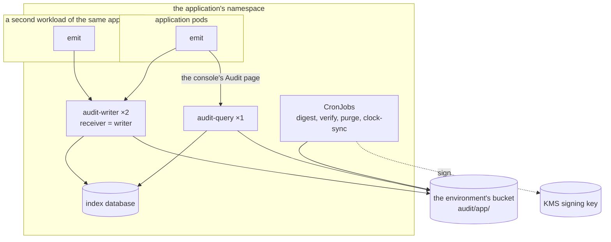
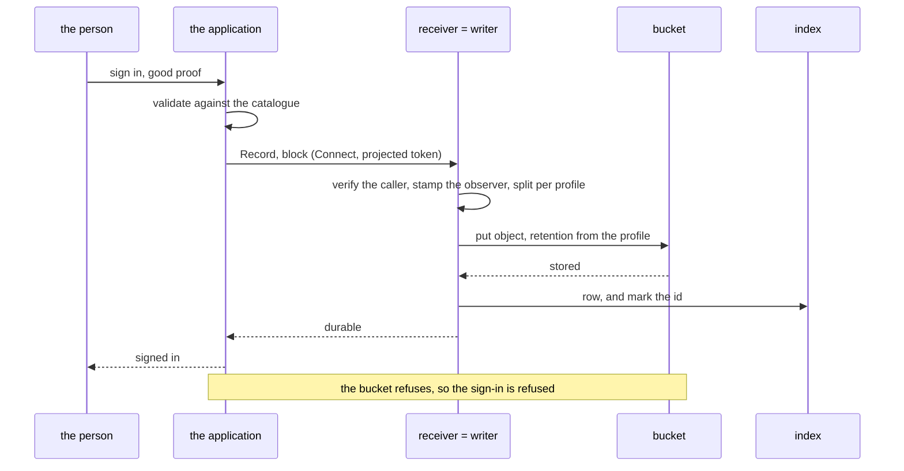

# Direct mode

The receiver is the writer. A record arrives over Connect, is validated,
split per profile, rolled into an object and put into the bucket, and only
then acknowledged. There is no stream and nothing to consume.

This is the shape for an internal service — an identity service, an
operations console, anything whose record rate is tens or hundreds a minute
rather than thousands a second — and for any cluster that has no message
stream to use.

## What it looks like



Two receiver replicas are safe: the deduplication table is in Postgres, so
two pods cannot write the same record twice, and the application's client
follows the Service to whichever is ready.

## One record

A privileged sign-in, declared `block` in the catalogue:



An `async` record takes the same path, except that the application does not
wait: it is queued, batched with whatever else is queued, and the batch is put
and acknowledged as one. The application's queue holds a record from the
moment it is recorded until that acknowledgement — one flush interval plus a
round trip, and that is the loss window if the pod dies. The emitter's `Flush`
and `Batch` are the knobs.

## Values

The application's chart takes this one as a dependency and sets:

```yaml
audit:
  mode: direct
  bucket: audit-eu-central-1
  prefix: audit/app                 # required in a shared bucket
  region: eu-central-1
  kmsKey: alias/audit-archive
  replicas: 2

  profiles:
    security:
      presets: [security]

  keys:
    provider: none
  externalIdentifiersAreOpaque: true

  database:
    existingSecret: audit-db
    migrate: true

  query:
    enabled: true
    replicas: 1
    database:
      existingSecret: audit-db-reader
      role: audit_query
    grants:
      issuers:
        - url: https://console.example.com
          audience: audit

  roll:
    interval: 60s

  jobs:
    digest:
      enabled: true
      kmsKey: alias/audit-digest
    verify:
      enabled: true
    purge:
      enabled: true
    clockSync:
      enabled: true
      ntp: ["169.254.169.123"]      # required by every compliance preset
```

Every value here renders today. `charts/audit/examples/direct.yaml` is the
same thing as a file, kept beside the chart and rendered by its tests.

`prefix` is what keeps two applications apart in one bucket, and the chart's
notes print the IAM statements the four roles need underneath it: the
writer, the digest job, the verify job and the query service, each scoped to
its own part of the prefix, and none of them with a delete.

## The index

The writer owns a database; the query service reads it as a separate role so
that the tenant row-level policies bind it. Create the role and grant it in
the same migration:

```console
$ audit migrate --database "$OWNER_URL" --reader audit_query
```

If the application already runs a Postgres cluster, this is one more
database in it. If it does not, a single-instance cluster is enough: the
index is rebuildable from the archive, so it needs no backup and no replica.

The same values are kept beside the chart as
[`charts/audit/examples/direct.yaml`](../../charts/audit/examples/direct.yaml),
where the chart's own tests render them.

## Checking it works

```console
$ audit conformance --query https://audit-query.app.svc:8080 \
      --profile security --token-file ./token
$ audit verify --bucket audit-eu-central-1 --prefix audit/app --public-key key.pub
```

The first asks the query service the questions every searcher must answer
the same way. The second walks the digest chain. Run the second an hour
after the first records land, so that there is a sealed hour to walk.

The [runbook](../operations/runbook.md) has what to do when either fails.
