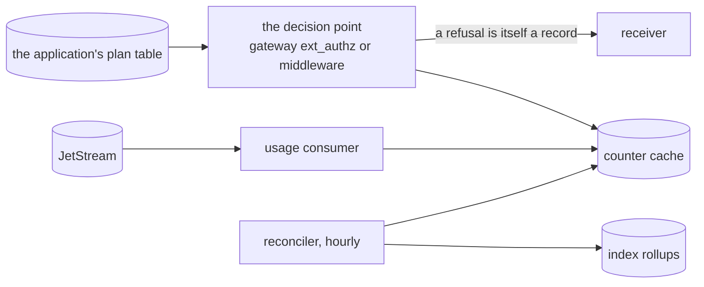

# Usage quotas

A quota — "ten thousand verifications a month on this plan" — is the same
meter [billing](billing.md) uses, counted quickly into a cache and corrected
slowly from the index. The records stay the source of truth; the cache is
only fast.

This is **not** burst rate limiting. "No more than fifty requests a second"
has to be decided before the request is served, from a counter that is
authoritative at that instant, and it belongs in the gateway's own
rate-limit service. A quota is a monthly total, tolerates seconds of lag,
and must agree with the invoice — which is why it is computed from the same
records the invoice is.

Quotas need [stream mode](../stream.md): without a stream there is nothing
for a second consumer to read.

## The five slots

| # | slot | what it does | whose |
|---|---|---|---|
| 1 | **catalogue** | the same `meter:` as billing — what is capped is what is billed | the application's |
| 2 | **usage consumer** | a second durable consumer on the stream: reads the meter and the tenant, dedupes by record id, increments `tenant:meter:period` in the cache, success outcomes only | shipped here, run by the application |
| 3 | **the decision** | the gateway's external authorisation, or middleware in the application, reads one key and joins the tenant's plan | the application's |
| 4 | **reconciler** | an hourly CronJob copies the exact rollups from the index into the cache, overwriting drift | shipped here, run by the application |
| 5 | **the denial is a record** | a refusal is an action in the catalogue, `async`, so that a customer's "you cut me off" has an answer | the application's |



## Fail open, and say so

The cache can be cold — a restart, an eviction, a new period. A missing
counter means "this tenant has used nothing", which would be wrong, and the
choice is between refusing a customer who has paid and serving a customer
who may be over.

**Serve them, and record that the decision was made without a count.** An
hour later the reconciler has the exact number from the index and the next
request is decided properly. The opposite choice turns a cache restart into
an outage for every customer at once, and quotas are a commercial control,
not a security one.

## Why not count in the cache alone

Because the cache is not evidence. It is evicted, it is not backed up, and
nobody can verify it a year later. Counting there alone means a customer's
dispute is answered with a number nobody can reconstruct. Counting from the
records means the cache can be wrong, be rebuilt from the index, and the
index itself can be rebuilt from the archive with `audit reindex` — three
levels, each recoverable from the one below it.

## Turning it on

```yaml
audit:
  mode: stream
  extensions:
    quotas:
      enabled: true               # renders nothing yet: the consumer and the reconciler are designed, not built
      cache:
        url: redis://valkey.app.svc:6379
      period: month
```

The decision point stays the application's: this component gives the
counter, the reconciler and the record of the refusal, and does not sit in
front of anybody's traffic.

## What to watch

- **Consumer lag** on the usage consumer, separately from the writer's. They
  are independent consumers of the same stream, and the usage one falling
  behind means quotas are being decided on stale counts.
- **Reconciler drift**: the difference the hourly job corrects. A drift that
  grows means the consumer is missing records, not that the cache is slow.
- **Denials**, which are records: a sudden rise is either an attack or a
  plan misconfigured, and both want a person.
