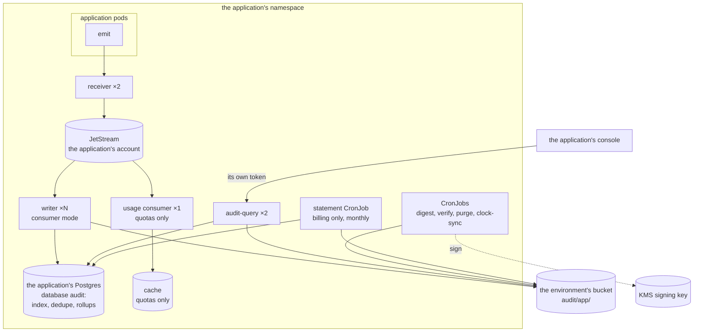
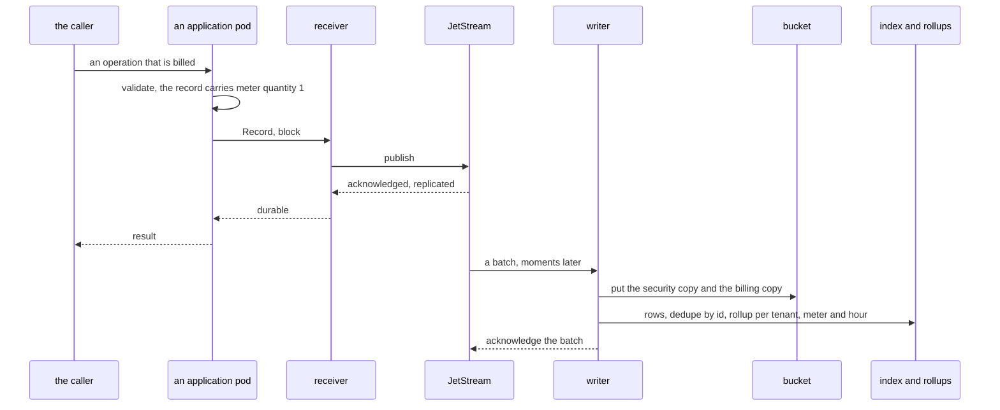

# Stream mode

The receiver publishes to a JetStream stream and acknowledges when the
stream says the record is replicated. Writers are separate pods that consume
the stream, put the objects and index them. Nothing in the application's
request path waits for S3.

This is the shape for a product: many application pods, a record rate that
makes batching worth having, a metering profile, and — if quotas are wanted
— a second consumer of the same stream.

## What it looks like



The stream is a buffer with a bounded horizon, not a store: the record
becomes durable evidence when the writer puts the object. What the stream
buys is that the application is never waiting for S3, that a writer rollout
becomes a backlog rather than a hole, and that a second consumer can read
the same records for something else.

## One record

A billable action, declared `block` because it will appear on an invoice:



The writer acknowledges to the stream only after the objects are in the
bucket, so a writer that dies mid-batch causes a redelivery and the dedupe
table absorbs it.

It also gathers before it writes. Fetching from a stream returns whatever is
there, and writing each fetch straight through would make an object of each; an
archive of many small objects costs a request to put, a line in every hour's
digest and an entry in every listing, forever. So the writer accumulates until
one of three is reached — `roll.maxRecords`, the roller's byte limit, or
`roll.interval` — and writes once. Nothing waits on this but the object:
the records are already durable on the stream, and they stay unacknowledged
until the put, so a writer that dies mid-window leaves them for the next one.

`stream.ackWait` must therefore exceed `roll.interval` plus the longest a put
can take. The chart refuses to render otherwise, because a stream that gives up
waiting sooner offers the same records to a second writer and the day's objects
quietly double.

## Values

```yaml
audit:
  mode: stream                      # not built yet: arrives with the rewrite
  bucket: audit-eu-central-1
  prefix: audit/app
  region: eu-central-1
  kmsKey: alias/audit-archive

  replicas: 2                       # receivers
  writer:
    consumers: 3                    # not built yet: writer pods consuming the stream

  stream:
    url: nats://nats.app.svc:4222
    name: AUDIT
    consumer: audit-writer
    batch: 100
    ackWait: 2m

  roll:
    interval: 30s
    maxRecords: 5000

  profiles:
    security:
      presets: [security]
    billing:
      presets: [billing-nl]

  keys:
    provider: none
  externalIdentifiersAreOpaque: true

  database:
    existingSecret: audit-db

  query:
    enabled: true
    replicas: 2
    database:
      existingSecret: audit-db-reader
      role: audit_query
    grants:
      issuers:
        - url: https://gateway.example.com
          audience: audit

  jobs:
    digest: { enabled: true, kmsKey: alias/audit-digest }
    verify: { enabled: true }
    purge: { enabled: true }
    clockSync:
      enabled: true
      ntp: ["169.254.169.123"]

  extensions:                       # not built yet
    billing:
      enabled: true
    quotas:
      enabled: false
```

The chart refuses `mode: stream` without `stream.url`, and refuses an
extension whose profile the deployment does not compose — `billing` with no
metering profile is a values mistake worth catching at render time.

## Who the query service trusts

In this shape the console is usually behind a gateway that issues its own
token, so the page calls the query service directly with the token the
person's session already has. The query service lists that issuer and
audience in its grants, and the grants decide which profiles and tenants the
person may read.

An application whose console keeps a session of its own instead — a cookie,
not a gateway token — reaches the query service through the console, which
mints a short token per person. Both are described in
[integrating](../guides/integrate.md#the-audit-page).

## Scaling

- **Receivers** scale with the application's request rate. They do almost no
  work: validate, publish, acknowledge.
- **Writers** scale with the record rate and the number of profiles, because
  each record becomes one object per profile per roll. They are the pods
  that touch S3 and Postgres.
- **The stream** is sized for the longest writer outage you want to survive.
  `DiscardNew` is the right policy: when it is full, refuse a publish rather
  than silently drop the oldest evidence.

## Checking it works

```console
$ audit conformance --query https://audit-query.app.svc:8080 \
      --profile security --token-file ./token
$ audit verify --bucket audit-eu-central-1 --prefix audit/app --public-key key.pub
```

Then check the two things that are specific to this shape: that the stream's
consumer has no growing pending count, and that a writer rollout leaves the
count briefly raised and then flat. A pending count that never returns to
zero means the writers cannot keep up or cannot write.
