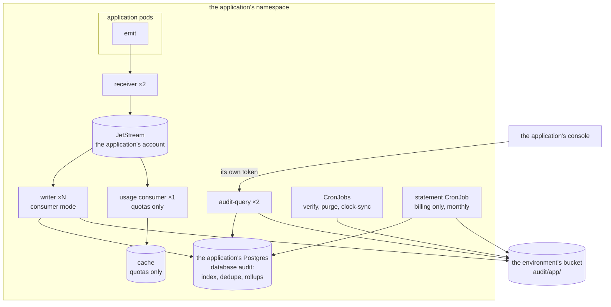
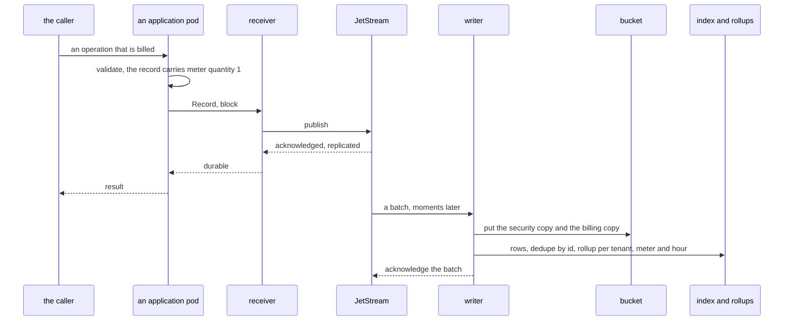

# Stream mode

The receiver publishes to a JetStream stream and acknowledges when the
stream says the record is replicated. Writers are separate pods that consume
the stream, put the objects and index them. Nothing in the application's
request path waits for S3.

This is the shape for a product: many application pods, a record rate that
makes batching worth having, a metering profile, and — if quotas are wanted
— a second consumer of the same stream.

## What it looks like


```mermaid
flowchart TB
  subgraph ns["the application's namespace"]
    subgraph APP["application pods"]
      E["emit"]
    end
    R["receiver ×2"]
    NATS[("JetStream<br/>the application's account")]
    W["writer ×N<br/>consumer mode"]
    U["usage consumer ×1<br/>quotas only"]
    Q["audit-query ×2"]
    PG[("the application's Postgres<br/>database audit:<br/>index, dedupe, rollups")]
    VK[("cache<br/>quotas only")]
    CJ["CronJobs<br/>verify, purge, clock-sync"]
    ST["statement CronJob<br/>billing only, monthly"]
    E --> R --> NATS
    NATS --> W --> PG
    NATS --> U --> VK
    Q --> PG
    ST --> PG
  end
  S3[("the environment's bucket<br/>audit/app/")]
  W --> S3
  Q --> S3
  CJ --> S3
  ST --> S3
  CONS["the application's console"] -- "its own token" --> Q
```

The stream is a buffer with a bounded horizon, not a store: the record
becomes durable evidence when the writer puts the object. What the stream
buys is that the application is never waiting for S3, that a writer rollout
becomes a backlog rather than a hole, and that a second consumer can read
the same records for something else.

## One record

A billable action, declared `block` because it will appear on an invoice:


```mermaid
sequenceDiagram
  participant C as the caller
  participant A as an application pod
  participant R as receiver
  participant N as JetStream
  participant W as writer
  participant S3 as bucket
  participant PG as index and rollups

  C->>A: an operation that is billed
  A->>A: validate, the record carries meter quantity 1
  A->>R: Record, block
  R->>N: publish
  N-->>R: acknowledged, replicated
  R-->>A: durable
  A-->>C: result
  N->>W: a batch, moments later
  W->>S3: put the security copy and the billing copy
  W->>PG: rows, dedupe by id, rollup per tenant, meter and hour
  W-->>N: acknowledge the batch
```

The writer acknowledges to the stream only after the objects are in the
bucket, so a writer that dies mid-batch causes a redelivery and the dedupe
table absorbs it.

It also gathers before it writes. Fetching from a stream returns whatever is
there, and writing each fetch straight through would make an object of each; an
archive of many small objects costs a request to put, an entry in every listing,
forever. So the writer accumulates until one of three is reached —
`roll.maxRecords`, the roller's byte limit, or `roll.interval` — and writes
once. Nothing waits on this but the object: the records are already durable on
the stream, and they stay unacknowledged until the put, so a writer that dies
mid-window leaves them for the next one.

`stream.ackWait` must therefore exceed `roll.interval` plus the longest a put
can take. The writer refuses to start otherwise, because a stream that gives up
waiting sooner offers the same records to a second writer and the day's objects
quietly double.

## Values

Each component's `config:` is the binary's own configuration file, validated
against its schema; secrets are named there and supplied by `secretEnv`
([configuration reference](../reference/configuration.md#chart-values)). The
receiver is `audit-writer` with `mode: receiver`: it holds neither the
archive nor a key, and has its own `config:`.

```yaml
audit:
  mode: stream
  replicas: 2                       # receivers
  profiles:
    security:
      presets: [security]
    billing:
      presets: [billing-nl]
  externalIdentifiersAreOpaque: true
  workloadIdentity:
    issuers:
      - url: https://oidc.example.com/id/CLUSTER
    workloads:
      - subject: system:serviceaccount:app:api
        source: app

  migrate:
    enabled: true
    config:
      database:
        url: postgres://audit@db.example.com:5432/audit?sslmode=verify-full
        passwordEnv: AUDIT_DATABASE_PASSWORD
      reader: audit_query
    secretEnv:
      - {name: AUDIT_DATABASE_PASSWORD, secretName: audit-db, key: password}

  receiver:
    config:
      mode: receiver
      deployment: /etc/audit/deployment.yaml
      workloads: /etc/audit/workloads.yaml
      database:
        url: postgres://audit@db.example.com:5432/audit?sslmode=verify-full
        passwordEnv: AUDIT_DATABASE_PASSWORD
      stream:
        nats:
          url: nats://nats.app.svc:4222
          tokenFile: /var/run/audit/stream/token   # the broker verifies who connects
        name: AUDIT
    secretEnv:
      - {name: AUDIT_DATABASE_PASSWORD, secretName: audit-db, key: password}
    tokens:
      - {audience: nats, mountPath: /var/run/audit/stream}

  writer:
    consumers: 3
    config:
      deployment: /etc/audit/deployment.yaml
      workloads: /etc/audit/workloads.yaml
      replicas: 3                   # must equal writer.consumers
      archive:
        bucket: {name: audit-eu-example-1, region: eu-example-1}
        prefix: audit/app
        kmsKey: alias/audit-archive
      database:
        url: postgres://audit@db.example.com:5432/audit?sslmode=verify-full
        passwordEnv: AUDIT_DATABASE_PASSWORD
      stream:
        nats:
          url: nats://nats.app.svc:4222
          tokenFile: /var/run/audit/stream/token
        name: AUDIT
        consumer: audit-writer
        batch: 100
        ackWait: 2m
      roll:
        interval: 30s
        maxRecords: 5000
    secretEnv:
      - {name: AUDIT_DATABASE_PASSWORD, secretName: audit-db, key: password}
    tokens:
      - {audience: nats, mountPath: /var/run/audit/stream}

  query:
    enabled: true
    replicas: 2
    grants:
      issuers:
        - {url: https://gateway.example.com, audience: audit}
    config:
      deployment: /etc/audit/deployment.yaml
      grants: /etc/audit/grants.yaml
      sink: {url: "http://audit:8080", tokenFile: /var/run/audit/token}
      database:                     # its own role, not the owner
        url: postgres://audit_query@db.example.com:5432/audit?sslmode=verify-full
        passwordEnv: AUDIT_QUERY_DATABASE_PASSWORD
      archive:
        bucket: {name: audit-eu-example-1, region: eu-example-1}
        prefix: audit/app
    secretEnv:
      - {name: AUDIT_QUERY_DATABASE_PASSWORD, secretName: audit-db-reader, key: password}
    tokens:
      - {audience: audit, mountPath: /var/run/audit}

  # jobs.verify, purge and clockSync are configured as in direct mode.

  # Both render nothing yet; the toggles are here so that a deployment's
  # values do not change when the work that fills them lands.
  extensions:
    billing:
      enabled: true
    quotas:
      enabled: false
```

The chart refuses `mode: stream` without `receiver.config` or
`writer.config.stream`, and refuses an extension whose profile the deployment
does not compose: `billing` with no metering profile is a values mistake worth
catching at render time. The binary refuses a `receiver` without `stream`.

## Authenticating to the stream

The receiver and the writers are workloads, and they identify themselves to
the broker the way the application identifies itself to the receiver: with
the projected service-account token the kubelet gives them, never with a
credential somebody stored. Give the receiver and the writers a `tokens`
entry of the broker's audience (`nats`), and name the file in
`stream.nats.tokenFile`: each pod that reaches the stream mounts the token and
presents it as its NATS token, read afresh on every connect because the
kubelet replaces it before it expires and the broker drops a connection whose
token has.

```yaml
audit:
  receiver:
    config:
      stream:
        nats:
          url: nats://nats.app.svc:4222
          tokenFile: /var/run/audit/stream/token
    tokens:
      - audience: nats
        mountPath: /var/run/audit/stream
        expirationSeconds: 3600
  # the writer's stream.nats and tokens are the same
```

The broker's side is the deployment's: an auth callout that takes the token
from the connect request, reviews it with the cluster (a `TokenReview`), and
answers with a user in the account that namespace maps to. The responder must
accept the audience the `tokens` entry projects, and the mapping decides
which account the installation publishes into; neither is this chart's to
configure. A broker that verifies nobody needs nothing here: leave out
`tokenFile` and the `tokens` entry, and the pods connect with no credentials.

A broker that binds the session to the token ends it when the token expires,
so each pod reopens its connection thirty seconds before the token it
presented does, by then long renewed in the file. The expiry is read from the
token's `exp` claim without verifying it: it only says when to ask again, and
the broker decides the rest. The planned reconnect is logged at INFO, and a
publish in flight across it — or across any other reconnect — is sent again
once the connection is back, under the same message id, so it neither fails
its caller nor lands twice. A consumer whose pulls fail, as they do while the
stream elects a leader, retries after a pause that grows from a tenth of a
second to five.

A token the broker refuses at start-up stops the pod with the reason in its
log, as a missing stream does. A refusal later — a token that was stale for a
moment, or a file that could not be read — is retried on the next reconnect
with the file read again, and is logged; the token itself never is.

## Who the query service trusts

In this shape the console is usually behind a gateway that issues its own
token, so the page calls the query service directly with the token the
person's session already has. The query service lists that issuer and
audience in its grants, and the grants decide which profiles and tenants the
person may read.

An application whose console keeps a session of its own instead — a cookie,
not a gateway token — reaches the query service through the console, which
mints a short token per person. Both are described in
[integrating](../guides/integrate.md#the-audit-page).

## Scaling

- **Receivers** scale with the application's request rate. They do almost no
  work: validate, publish, acknowledge.
- **Writers** scale with the record rate and the number of profiles, because
  each record becomes one object per profile per roll. They are the pods
  that touch S3 and Postgres.
- **The stream** is sized for the longest writer outage you want to survive.
  `DiscardNew` is the right policy: when it is full, refuse a publish rather
  than silently drop the oldest evidence.

The same values are kept beside the chart as
[`charts/audit/examples/stream.yaml`](../../charts/audit/examples/stream.yaml),
where the chart's own tests render them.

## Checking it works

```console
$ audit conformance --query https://audit-query.app.svc:8080 \
      --profile security --token-file ./token
$ audit verify --profile security --last 24h \
      --bucket audit-eu-example-1 --prefix audit/app
```

Then check the two things that are specific to this shape: that the stream's
consumer has no growing pending count, and that a writer rollout leaves the
count briefly raised and then flat. A pending count that never returns to
zero means the writers cannot keep up or cannot write.
