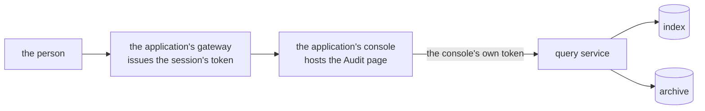

# The Audit page

One page, in the application's own console. It is a React component from
`@truvity/audit` (`ts/`, `@truvity/audit/react`) that the console renders
like any other page of itself, and it calls the query service of the
installation in that application's namespace.

There is no standalone console and no second surface. A console existed in
the earlier design because a central installation served several
applications and had no console of its own to live in; an installation now
belongs to one application, which already has one
([0011](../decisions/0011-one-installation-per-service-or-product.md)).

## Who the token belongs to

The page holds **no credentials of its own** and does no authentication. It
is handed a transport with a bearer, and the query service decides what that
bearer may read.

**The usual case: the console's own gateway-issued token.** The console sits
behind a gateway that authenticates the person and issues the token their
session already carries. The page calls the query service directly with it.
The query service lists that issuer and audience among its grants, and the
grants say which profiles, tenants, operations and period the person may
read. Nothing is minted for the page, and nothing about the audit trail is
configured in the console beyond the query service's address.

**A console whose session is a cookie of its own** cannot hand the page a
bearer, because it has none. Such a console proxies the query service and
mints a short-lived token per person from the claims of its own session,
with an audience the query service trusts. A console that is itself an
issuer, or sits beside one, mints such a token cheaply, and the token never
reaches the browser; a cookie console with no issuer is the one for which
this costs a signing key, a mint path and a proxy route, and where a
gateway-issued token is preferred if there is one. Either way the grants are
the query service's, not the console's.

Both are described from the application's side in
[integrating](../guides/integrate.md#the-audit-page), and the cookie case in
[a console with a session of its own](../guides/integrate.md#a-console-with-a-session-of-its-own).

## Navigation

Profiles are the top level. A person sees only the profiles their grant
allows, as the query service's `Access` reports them. Inside a profile:
tenant scope, time range with a histogram from the counts table, a facet
sidebar, a qualifier box (`actor:` `action:` `target:` `outcome:` `tenant:`
and a time range) that compiles to the typed filter, and the
reverse-chronological table.

The page shows one installation, which is one application's trail. A view
over several applications is a read across several prefixes, not a surface
here.

## Row

A human sentence rendered from the catalogue template (ICU MessageFormat,
locale-aware), actor, target, outcome, time, and for the security profile
the client address. Expanding shows the JSON with filter-for and filter-out
on every value, the old-versus-new diff on updates, pivots by request id,
trace id, actor and target, a permalink by event id, and the integrity
badge when a verified digest covers the record.

Where the deployment runs no pseudonymisation keys — the default — an
identity is shown as it was written, and the page offers no resolve: the
query service refuses the operation as unimplemented rather than returning
nothing
([0013](../decisions/0013-no-pseudonymisation-keys-by-default.md)).

## Actions

Live tail (polls the tail cursor), export (async job, signed URL), copy
permalink.

Every one of them is a read of the trail, so every one of them is itself
recorded. The page does nothing to make that so; the query service does.

## Not Grafana

Grafana's Postgres datasource is right for operator dashboards over the
counts table. It cannot scope by the viewer's tenant claim, render
catalogue sentences, run export jobs or show integrity, so it complements
the page.
