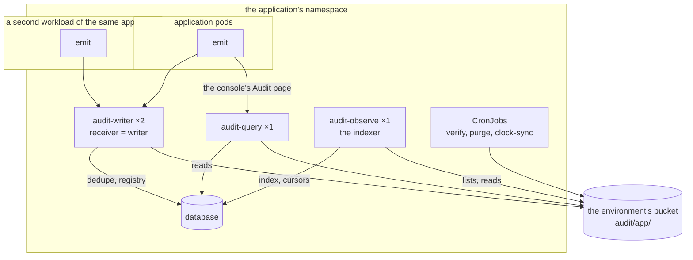
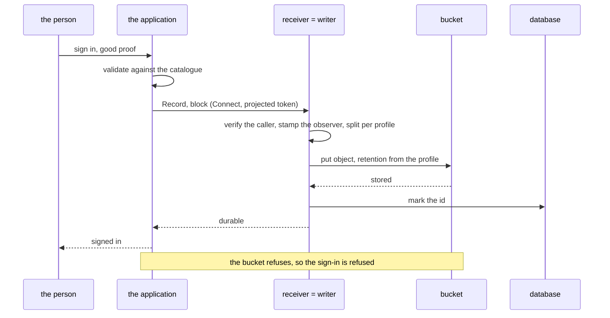

# Direct mode

The receiver is the writer. A record arrives over Connect, is validated,
split per profile, rolled into an object and put into the bucket, and only
then acknowledged. There is no stream and nothing to consume.

This is the shape for an internal service — an identity service, an
operations console, anything whose record rate is tens or hundreds a minute
rather than thousands a second — and for any cluster that has no message
stream to use.

## What it looks like



Two receiver replicas are safe: the deduplication table is in Postgres, so
two pods cannot write the same record twice, and the application's client
follows the Service to whichever is ready.

## One record

A privileged sign-in, declared `block` in the catalogue:



An `async` record takes the same path, except that the application does not
wait: it is queued, batched with whatever else is queued, and the batch is put
and acknowledged as one. The application's queue holds a record from the
moment it is recorded until that acknowledgement — one flush interval plus a
round trip, and that is the loss window if the pod dies. The emitter's `Flush`
and `Batch` are the knobs.

## Values

The application's chart takes this one as a dependency and sets the values
below. Each component's `config:` is the binary's own configuration file,
validated against its schema, and a secret is only ever named there, with
`secretEnv` supplying it from a Secret
([configuration reference](../reference/configuration.md#chart-values)).

```yaml
audit:
  mode: direct
  replicas: 2                       # writer.config.replicas must say the same
  profiles:
    security:
      presets: [security]
  externalIdentifiersAreOpaque: true
  workloadIdentity:
    issuers:
      - url: https://oidc.example.com/id/CLUSTER
    workloads:
      - subject: system:serviceaccount:app:api
        source: app

  migrate:
    enabled: true
    config:
      database:
        url: postgres://audit@db.example.com:5432/audit?sslmode=verify-full
        passwordEnv: AUDIT_DATABASE_PASSWORD
      reader: audit_query
    secretEnv:
      - {name: AUDIT_DATABASE_PASSWORD, secretName: audit-db, key: password}

  writer:
    config:
      deployment: /etc/audit/deployment.yaml
      workloads: /etc/audit/workloads.yaml
      replicas: 2
      archive:
        bucket: {name: audit-eu-example-1, region: eu-example-1}
        prefix: audit/app           # required in a shared bucket
        kmsKey: alias/audit-archive
      database:
        url: postgres://audit@db.example.com:5432/audit?sslmode=verify-full
        passwordEnv: AUDIT_DATABASE_PASSWORD
      roll:
        interval: 60s
    secretEnv:
      - {name: AUDIT_DATABASE_PASSWORD, secretName: audit-db, key: password}

  query:
    enabled: true
    replicas: 1
    grants:
      issuers:
        - {url: https://console.example.com, audience: audit}
    config:
      deployment: /etc/audit/deployment.yaml
      grants: /etc/audit/grants.yaml
      sink: {url: "http://audit:8080", tokenFile: /var/run/audit/token}
      database:                     # its own role, not the owner
        url: postgres://audit_query@db.example.com:5432/audit?sslmode=verify-full
        passwordEnv: AUDIT_QUERY_DATABASE_PASSWORD
      archive:
        bucket: {name: audit-eu-example-1, region: eu-example-1}
        prefix: audit/app
    secretEnv:
      - {name: AUDIT_QUERY_DATABASE_PASSWORD, secretName: audit-db-reader, key: password}
    tokens:
      - {audience: audit, mountPath: /var/run/audit}

  jobs:
    clockSync:
      config:
        ntp: ["169.254.169.123"]    # required by every compliance preset
        sink: {url: "http://audit:8080", tokenFile: /var/run/audit/token}
      tokens:
        - {audience: audit, mountPath: /var/run/audit}
    # verify and purge are configured the same way: see the example file
```

Every value here renders today. `charts/audit/examples/direct.yaml` is the
whole thing as a file, with the verify and purge jobs, kept beside the chart
and rendered by its tests.

`prefix` is what keeps two applications apart in one bucket, and the chart's
notes print the IAM statements the three roles need underneath it: the
writer, the verify job and the query service, each scoped to
its own part of the prefix, and none of them with a delete.

## The index

One database, three parts that use it, and a role for each: the migration
owns the tables and nothing else connects as it; the writer's role holds the
deduplication table and the registry and none of the index; the indexer's
(`audit-observe`, which follows the bucket and writes the index) holds the
index; and the query service's reads it, so that the tenant row-level policies
bind it. Create the roles and grant them in the same migration:

```console
$ audit migrate --database "$OWNER_URL" --writer audit_writer \
    --observe audit_observe --reader audit_query
```

In the chart this is the `migrate` hook above, which runs `audit migrate
--config` with the same settings in its file, and `observe.enabled` runs the
indexer as a Deployment of its own. The index is behind the archive by the
indexer's settle window (two minutes by default,
[0020](../decisions/0020-observe-follows-the-bucket.md)); anything that must
see a record sooner reads the sink's acknowledgement, not the index.

If the application already runs a Postgres cluster, this is one more
database in it. If it does not, a single-instance cluster is enough: the
index is rebuildable from the archive, so it needs no backup and no replica.

The same values are kept beside the chart as
[`charts/audit/examples/direct.yaml`](../../charts/audit/examples/direct.yaml),
where the chart's own tests render them.

## Checking it works

```console
$ audit conformance --query https://audit-query.app.svc:8080 \
      --profile security --token-file ./token
$ audit verify --profile security --last 24h \
      --bucket audit-eu-example-1 --prefix audit/app
```

The first asks the query service the questions every searcher must answer
the same way. The second checks every record object of the profile in the last
day against the bucket contract, from the archive alone; run it after the
first records have landed.

The [runbook](../how-to/rebuild-the-index.md) has what to do when either fails.
