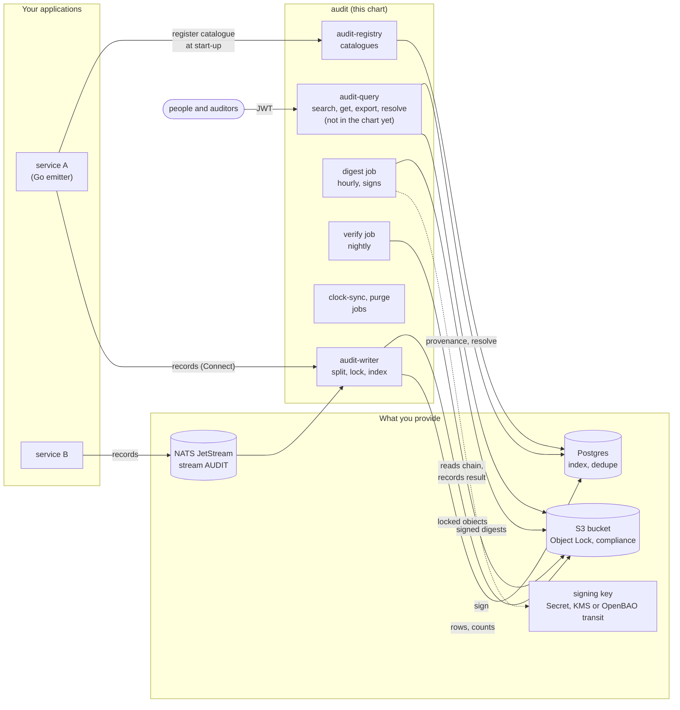

# Deploying

How to run the audit trail in a Kubernetes cluster: what to prepare, how to
install the chart, and how to check that it works. For what each piece is and
why, read [concepts](../concepts.md) and [the pipeline](../design/pipeline.md);
this page is the procedure.

## What runs where



- **Applications** register their catalogue with the registry once at start-up,
  then send records to the writer: directly over Connect, or through a NATS
  JetStream stream the writer consumes. Every call carries the workload's
  projected service-account token, which the writer and the registry verify.
- **The writer** validates each record against its catalogue, splits it into
  one copy per profile, pseudonymises what each profile says to, writes the
  copies into the bucket under Object Lock, and indexes them in Postgres.
- **The jobs** seal each hour into a signed digest chain, verify it nightly,
  record the clock's offset from UTC, and prune the index past each profile's
  retention.
- **The query service** answers searches and reads for people, behind their
  sign-in and your grants. The chart does not deploy it yet
  ([below](#the-query-service)).

## Before you start

**Images.** Four images, one per binary, built by ko from `.goreleaser.yaml`
into `ghcr.io/truvity/audit-writer`, `audit`, `audit-registry` and
`audit-query`. No release has been published yet; until one is, build them
with `just snapshot` and push them to a registry your cluster can pull from,
then set `image.*.repository` and `image.*.tag`.

**A bucket with Object Lock in compliance mode.** Object Lock can only be
turned on when a bucket is created. The writer sets each object's retention
itself, from its profile, so the bucket needs no default retention. Everything
else — encryption, the policy that denies deletes, replication, the
break-glass role — is in [the S3 guide](../operations/s3-guide.md). The shortest
correct start:

```sh
aws s3api create-bucket --bucket example-audit \
  --create-bucket-configuration LocationConstraint=eu-central-1 \
  --object-lock-enabled-for-bucket
```

**Postgres** for the index, the deduplication table and the registry. Any
Postgres 15 or later; the chart takes a URL from a Secret and runs the schema
migration as a hook before the writer rolls.

**A NATS JetStream stream**, if applications publish through one. Create it
yourself — the writer refuses to start on a stream that is not there, and never
creates one — and make it refuse rather than drop when full:

```sh
nats stream add AUDIT --subjects 'audit.records' --storage file \
  --discard new --dupe-window 2m --defaults
```

**Keys.**

```sh
# The 32-byte root the pseudonymisation keys are wrapped under.
head -c 32 /dev/urandom > root
kubectl create secret generic audit-key-root --from-file=root=root

# The digest signing key, if you sign with a key file. Signing with AWS KMS
# (jobs.digest.kmsKey) or OpenBAO transit (jobs.digest.transit) keeps the
# private half out of the cluster instead, and is the better choice.
openssl genpkey -algorithm ed25519 -out key.pem
openssl pkey -in key.pem -pubout -out public.pem
kubectl create secret generic audit-signing-key --from-file=key.pem=key.pem
kubectl create secret generic audit-signing-public --from-file=public.pem=public.pem
```

Keep `root` and `key.pem` somewhere other than the cluster. Losing the root
makes every pseudonym unrecomputable; see
[key custody](../operations/key-custody.md).

**Workload identity.** The writer and the registry verify each caller's
projected service-account token against your cluster's OIDC issuer. You need
the issuer URL exactly as the tokens' `iss` claim spells it — on EKS, the
cluster's OIDC provider URL — and it must be reachable from the pods over
HTTPS.

**Cloud credentials.** The writer's role needs `s3:PutObject`,
`s3:PutObjectRetention`, `s3:GetObjectRetention` and `s3:PutObjectLegalHold`
on the bucket and read access to `holds/`. The retention pair is for
addenda: a record that extends an earlier one lengthens the lock on the
object holding it, and reads the lock first so that it never asks for a
shorter one. The digest job's needs `s3:PutObject` on `digest/*` and,
with KMS, `kms:Sign` on its key; the verify job's needs read access and
`s3:PutObject` on `verified/*`. Annotate the service accounts with Pod Identity
or IRSA through `serviceAccount.annotations` and
`jobs.*.serviceAccount.annotations`.

## Install

A production values file:

```yaml
bucket: example-audit
region: eu-central-1
kmsKey: alias/audit            # SSE-KMS for every object

profiles:                      # what copies are kept, each from presets
  security: { presets: [security] }
  history:  { presets: [history] }

database:
  existingSecret: audit-database   # key `url`: postgres://…

stream:
  url: nats://nats.nats.svc:4222

keys:
  local:
    existingSecret: audit-key-root
    persistence:
      accessModes: [ReadWriteMany]  # required for more than one replica
replicas: 3

workloadIdentity:
  issuers:
    - url: https://oidc.eks.eu-central-1.amazonaws.com/id/EXAMPLE
  workloads:                   # which service account speaks for which source
    - subject: system:serviceaccount:shop:shop
      source: shop

registry:
  enabled: true

jobs:
  digest:
    kmsKey: alias/audit-digest # or signingKey.existingSecret, or transit
  verify:
    publicKey:
      existingSecret: audit-signing-public
  clockSync:
    ntp: [time.cloudflare.com]

telemetry:
  otlpEndpoint: http://otel-collector.observability.svc:4318
```

```sh
helm install audit ./charts/audit -n audit --create-namespace -f values.yaml
```

The chart **refuses to render** a configuration the binaries would reject or
accept and get quietly wrong — more replicas than the key directory can serve,
a digest job with no signer, a registry with no way to verify callers, and
others. Each refusal says why; the list is in
[the chart README](../../charts/audit/README.md). Every setting is in
[`values.yaml`](../../charts/audit/values.yaml) with its reason beside it.

For a throwaway install — no database, no stream, callers not verified — see
[`testdata/values/minimal.yaml`](../../charts/audit/testdata/values/minimal.yaml).

## Check that it works

1. **The writer is up.** `kubectl -n audit rollout status deploy/audit`. It
   refuses to start, with the reason in its log, if the database is at another
   schema version, the stream is missing, the holds cannot be read, or its key
   directory is not the one the other replicas share.
2. **A record goes through.** Run [the example application](emit.md) with
   `AUDIT_WRITER=http://audit.audit:8080`, or send one from any workload the
   chart's `workloadIdentity.workloads` lists.
3. **It is in the archive.** `aws s3 ls s3://example-audit/profile=security/ --recursive`
   lists an object per profile, tenant and roll interval.
4. **The chain seals and verifies.** After the next hour the digest job writes
   `digest/profile=…/hour=NN.json`; the next night the verify job records a
   result under `verified/`. An auditor checks the same thing with nothing but
   read access and the public key:

   ```sh
   audit verify --profile security --last 24h --bucket example-audit --public-key public.pem
   ```

5. **Alerts.** With `telemetry.otlpEndpoint` set, page on
   `audit_writer_index_deferred_total` (the index is behind the archive) and
   `audit_writer_dead_lettered_total` (records the writer could not process),
   and, with an evidence profile, `audit_writer_retention_not_extended_total`
   (an addendum could not lengthen the lock on an earlier record).
   The [runbook](../operations/runbook.md) says what to do about each.

## The query service

`audit-query` is built but not yet in the chart (tracked as the read-side
chart work). Until it is, run the `ghcr.io/truvity/audit-query` image as a
Deployment of your own with these flags (or their `AUDIT_*` environment
variables):

| flag | what |
|---|---|
| `--searcher postgres --database <url>` | where answers come from; `s3scan --bucket` for a deployment with no database |
| `--bucket <b>` | the archive, read-only: which digest covers a record and when it was verified |
| `--grants <file>` | who may sign in and what each caller may see — see [reading](read.md#access) |
| `--deployment <file>` | the profiles, when the grants file uses a preset |
| `--sink http://audit.audit:8080` | the writer: every read is itself recorded |
| `--exports <bucket>` | a separate, unlocked bucket for exports; without it export is refused |
| `--key-root --key-dir` | only if this service may resolve pseudonyms |

Connect it to Postgres as a role that **does not own** the tables and has
`SELECT` only: row-level security applies to that role and not to an owner, and
it is what holds when a query forgets its tenant term.

## Day two

- [Runbook](../operations/runbook.md): the index is behind, a dead letter, the
  key directory changed, a clock out of tolerance.
- [Legal holds](../operations/s3-guide.md#legal-hold): `audit hold place|release|list`.
- Erasure: `audit key destroy --tenant <t> --purpose <profile>`; refused while a
  hold covers the tenant.
- Rebuilding the index: `audit reindex --profile <p> --from <day> --to <day>`.
