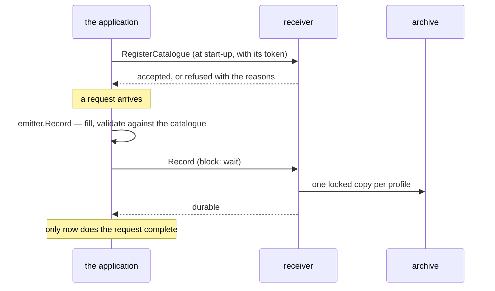

# Emitting records

How an application records what it does. The working code is
[`examples/emit`](../../examples/emit/main.go), compiled and tested on every
run of the gate; this page walks through it.

The emitter is a **library in the application's own process**. Everything
after it — the receiver, the writer, the query service — is a Deployment in
the application's namespace
([0011](../decisions/0011-one-installation-per-service-or-product.md)), so the
application holds the address of a Service and nothing else.



## 1. Describe your actions: the catalogue

A catalogue lists every action your application records: what it is, which
profiles keep it, how it is delivered, and how it reads as a sentence. It
lives next to the code that emits it, so the two change together.

```yaml
source: shop
version: "1.0.0"
locales: [en]
actor_kinds:
  customer: { category: external, description: A person buying from the shop. }
  clerk:    { category: internal, description: A member of staff. }
target_types:
  order: { description: "An order." }
actions:
  shop.order.placed:
    summary: A customer placed an order.
    operation: create
    categories: [data_change]
    profiles: [security]
    target_types: [order]
    delivery: block
    data_schema: https://schemas.example.com/shop/order-placed.json
    message: { en: "{actor} placed order {targets_0_id}" }
```

- **`category`** of an actor kind decides how profiles treat its identifiers.
  A profile keeps `internal` staff in clear for accountability, and treats
  `external` people as the deployment's key configuration says — which, by
  default, is also in clear, because a product's identifier for a person is
  already opaque
  ([0013](../decisions/0013-no-pseudonymisation-keys-by-default.md)).
- **`delivery`** is `block` or `async`, described below.
- **`data_schema`** describes your own fields. Every property says which class
  it belongs to and whether it is personal data, and the writer keeps it only
  in the profiles that keep that class. Direct identity attributes — names,
  e-mail addresses — are refused outright. A property marked
  `x-audit-expiry: true` is when the thing the record is about expires, and
  evidence profiles keep the record for years after it.
- **`extends`** makes an action an addendum: it names a data property holding
  the ids of earlier records this one relies on — a renewal naming the
  issuance, a credential naming the identity proofing behind it. The writer
  then locks the objects holding those records until this record's expiry plus
  the profile's years, if that is later than their lock, and records
  `audit.retention.extended`. Locks only ever get longer.

The full vocabulary is [the catalogue reference](../reference/catalogue.md)
and [extension points](../reference/extension-points.md). Check a catalogue
before you ship it:

```sh
audit validate path/to/catalogue.yaml
audit check-emitters ./ --catalogue path/to/catalogue.yaml   # in CI
```

`check-emitters` finds the action names your code emits and fails if one is
not in the catalogue, or if the catalogue declares one nothing emits. Put each
action name in code exactly once — a constructor per action
([integrating](integrate.md#one-constructor-per-action)) — so it can see them.

### The two deliveries

| delivery | the call returns | if the receiver is down | for |
|---|---|---|---|
| `block` | when the receiver has acknowledged durability | the call fails, and so must the action | a privileged sign-in, a key destruction, a billable operation |
| `async` (the default) | at once | the record waits in a bounded in-memory queue and is retried with backoff | everything else |

**The acknowledgement always means durable.** In stream mode it is the
stream's replicated publish acknowledgement; in direct mode it is the object
in the bucket: the receiver puts every batch it takes before answering.
Nobody is waiting on an `async` batch, so that costs queue depth and nothing
else.

An `async` record is lost only if the application's pod dies with the record
still queued — one flush interval of records plus the batch in flight — or if
an outage long enough to overflow the queue drops the oldest, which are
counted and logged.

`outbox` and `best_effort` are **retired**
([0012](../decisions/0012-two-deliveries-and-a-durable-ack.md)). The catalogue
loader refuses both and names the replacement. There is no file outbox, no
volume on the emitting pod and no `AUDIT_OUTBOX_DIR`: an action either matters
enough to keep, in which case `async` retries until it is kept, or it does not
belong in the catalogue.

## 2. Register it at start-up

```go
err := emit.Register(ctx, emit.Registration{
	URL:    receiverURL,
	Source: shop.Source, Version: shop.Version,
	Document: document,
	Schemas:  map[string][]byte{"https://schemas.example.com/shop/order-placed.json": schema},
	HTTP:     auth.TokenFile(os.Getenv("AUDIT_TOKEN_FILE")),
})
```

The **receiver** serves `RegisterCatalogue`. There is no registry service and
no `audit-registry` binary: an installation has one application to hear a
catalogue from, and the receiver already validates every record against it
([0011](../decisions/0011-one-installation-per-service-or-product.md)).

**Do not start if it fails with `emit.ErrCatalogueRefused`.** A malformed
catalogue is a fact about the document, and trying again will not change it;
records written against a description nothing accepted are records nobody can
read. A receiver that is merely unreachable is a different error and may be
retried. Registering the same version again is not an error — every replica
does it on every roll.

The caller's identity comes from its **service account**, not from the
document. Mount a projected token with the audience the installation uses
(default `audit`):

```yaml
volumes:
  - name: audit-token
    projected:
      sources:
        - serviceAccountToken: { path: token, audience: audit, expirationSeconds: 3600 }
```

and point `AUDIT_TOKEN_FILE` at it. `auth.TokenFile` reads it on every
request, because the kubelet replaces it before it expires. A profile's
required categories are the deployment's to cover, not one catalogue's: a gap
is reported, not held against you.

## 3. Create the emitter

```go
emitter, err := emit.New(emit.Options{
	Source:    shop.Source,
	Catalogue: shop,
	Sink:      sink.NewClient(auth.TokenFile(tokenPath), receiverURL),
	Version:   "1.0.0",
	Instance:  os.Getenv("HOSTNAME"),
	Queue:     1024,              // how many async records may wait; this is the default
	Hooks: emit.Hooks{
		OnDropped: func(r *record.Record, reason string) { /* alert, and log it */ },
	},
})
defer emitter.Close()
```

The **sink** is where records go. In both shapes that is the receiver in the
application's own namespace, over Connect:

```go
sink.NewClient(httpClient, receiverURL)
```

Whether the receiver then puts the object itself or publishes to a stream is
the installation's business, not the application's — the same catalogue and
the same code run against [direct](../deployment/direct.md) and
[stream](../deployment/stream.md). (`natssink.NewPublisher` exists, and the
writer's stream consumer is built on it, but an application publishing
straight to a stream is not a shape this component describes: it would hold
the stream's credentials.)

`Queue`, `Batch` and `Flush` size the `async` path: how many records may wait
(1024), how many are sent together (100) and how often (one second). Wrap the
hooks with `emit.Instrument(hooks, otel.GetMeterProvider())` to count what is
written, dropped and refused.

**Two metrics matter:**

| metric | what it says |
|---|---|
| `audit.emit.queue.pending` | how many records are waiting. A number that climbs is the warning — the receiver is slow or gone. (Not built yet: it arrives with the rewrite.) |
| `audit.emit.records.dropped` | how many the queue gave up. **Alert on it**: a drop is an incident, not a condition to tolerate. |

Every dropped record is written to the application's log by the emitter
(`Options.Logger`, or the default logger), so the loss is
visible where its other evidence is.

## 4. Record

```go
err := emitter.Record(r.Context(), &record.Record{
	Action:    "shop.order.placed",
	Operation: auditv1.Operation_OPERATION_CREATE,
	TenantId:  "acme",
	Actor:     &record.Actor{Kind: "customer", Id: customerID},
	Targets:   []*record.Target{{Type: "order", Id: orderID}},
	Outcome:   &record.Outcome{Result: auditv1.Outcome_RESULT_SUCCESS},
	Data:      data,
})
if err != nil {
	// block: the action did not happen as far as anyone can prove.
}
```

- The emitter fills the identifier, the times, the versions and a sequence,
  and validates the record against the catalogue before it is sent. A record
  the catalogue does not describe is refused here, not dead-lettered later.
- **`TenantId`** is the customer organisation this happened for, or
  `@platform` for the application's own operations. It is what a grant narrows
  by.
- **Record identifiers as they are.** The writer treats each identity by its
  category, per profile, with keys the application never holds. Never put
  names or e-mail addresses in a record: where the deployment has declared its
  external identifiers opaque, the writer refuses one that carries something
  direct, naming the field and why.
- **Record failures too**: `RESULT_FAILURE` or `RESULT_DENIED` with a reason.
  A refused action is often the more interesting one.

Wrap your HTTP handler in `emit.Middleware(trustedHops)` and every record made
while serving the request carries the client address, user agent, request id
and trace id. `trustedHops` is how many proxies of your own sit in front: get
it wrong and the trail records your load balancer as every actor's address.

## TypeScript

There is **no TypeScript emitter yet**. What exists today is the generated
contract in [`ts/src/gen`](../../ts/src/gen): protobuf-es v2 message types and
service descriptors, usable with `@connectrpc/connect` v2. A Node service can
call the receiver directly:

```ts
import { readFileSync } from "node:fs";
import { createClient } from "@connectrpc/connect";
import { createConnectTransport } from "@connectrpc/connect-node";
import { Delivery, SinkService } from "./gen/audit/v1/sink_pb";

const receiver = createClient(SinkService, createConnectTransport({
  baseUrl: process.env.AUDIT_RECEIVER!,
  httpVersion: "1.1",
  interceptors: [(next) => async (req) => {
    req.header.set("Authorization", `Bearer ${readFileSync(tokenFile, "utf8").trim()}`);
    return next(req);
  }],
}));
await receiver.write({ records: [record], delivery: Delivery.BLOCK });
```

Without the emitter, nothing checks the record against its catalogue before it
leaves: the receiver still does, and dead-letters what does not match, but the
caller learns late. Fill `id` (a UUIDv7), `occurred_at`, `schema_version`,
`catalogue_version` and `source` yourself.
