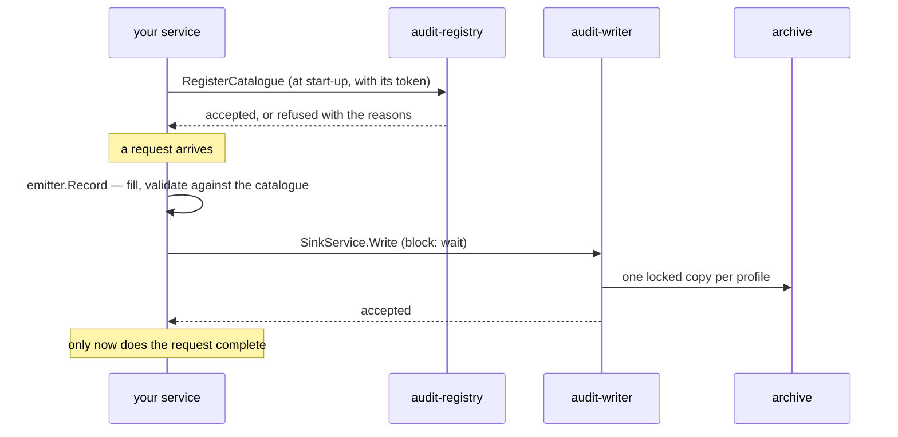

# Emitting records

How an application records what it does. The working code is
[`examples/emit`](../../examples/emit/main.go), compiled and tested on every
run of the gate; this page walks through it.



## 1. Describe your actions: the catalogue

A catalogue lists every action your application records: what it is, which
profiles keep it, how it is delivered, and how it reads as a sentence. It lives
next to the code that emits it, so the two change together.

```yaml
source: shop
version: "1.0.0"
locales: [en]
actor_kinds:
  customer: { category: external, description: A person buying from the shop. }
  clerk:    { category: internal, description: A member of staff. }
target_types:
  order: { description: "An order." }
actions:
  shop.order.placed:
    summary: A customer placed an order.
    operation: create
    categories: [data_change]
    profiles: [security, history]
    target_types: [order]
    delivery: block
    data_schema: https://schemas.example.com/shop/order-placed.json
    message: { en: "{actor} placed order {targets_0_id}" }
```

- **`category`** of an actor kind decides how profiles treat its identifiers:
  a profile may keep `internal` staff in clear and pseudonymise `external`
  people, for instance.
- **`delivery`** is `block` (the call waits until the record is durable, and
  fails if it is not — for privileged, security and billable actions),
  `outbox` (written to a local file first, sent when the writer is reachable)
  or `best_effort` (may drop under pressure, and says so).
- **`data_schema`** describes your own fields. Every property says which class
  it belongs to and whether it is personal data, and the writer keeps it only
  in the profiles that keep that class. Direct identity attributes — names,
  e-mail addresses — are refused outright. A property marked
  `x-audit-expiry: true` is when the credential the record is about expires,
  and evidence profiles keep the record for years after it.
- **`extends`** makes an action an addendum: it names a data property holding
  the ids of earlier records this one relies on — a renewal naming the
  issuance, a credential naming the identity proofing behind it. The writer
  then locks the objects holding those records until this record's expiry
  plus the profile's years, if that is later than their lock, and records
  `audit.retention.extended`. Locks only ever get longer.

The full vocabulary is in [the catalogue reference](../reference/catalogue.md)
and [extension points](../design/extension-points.md). Check a catalogue
before you ship it:

```sh
audit validate path/to/catalogue.yaml
audit check-emitters ./ --catalogue path/to/catalogue.yaml   # in CI
```

`check-emitters` finds the action names your code emits and fails if one is
not in the catalogue, or if the catalogue declares one nothing emits.

## 2. Register it at start-up

```go
err := emit.Register(ctx, emit.Registration{
	URL:    os.Getenv("AUDIT_REGISTRY"),
	Source: shop.Source, Version: shop.Version,
	Document: document,
	Schemas:  map[string][]byte{"https://schemas.example.com/shop/order-placed.json": schema},
	HTTP:     auth.TokenFile(os.Getenv("AUDIT_TOKEN_FILE")),
})
```

**Do not start if it fails.** The registry refuses a catalogue that is
malformed, or registered under another workload's source, and records written
against a description nobody accepted are records nobody can read. (A
profile's required categories are the deployment's to cover, across every
catalogue; a gap is reported, not held against you.) Registering the same version again is not an error; every replica does it
on every roll.

The registry decides whose catalogue it is from your **service account**, not
from the document: the deployment's `workloadIdentity.workloads` maps
`system:serviceaccount:<namespace>:<name>` to the source it may register. Mount
a projected token with the audience the deployment uses (default `audit`):

```yaml
volumes:
  - name: audit-token
    projected:
      sources:
        - serviceAccountToken: { path: token, audience: audit, expirationSeconds: 3600 }
```

and point `AUDIT_TOKEN_FILE` at it. `auth.TokenFile` reads it on every request,
because the kubelet replaces it before it expires.

## 3. Create the emitter

```go
emitter, err := emit.New(emit.Options{
	Source:    shop.Source,
	Catalogue: shop,
	Sink:      sink.NewClient(auth.TokenFile(tokenPath), os.Getenv("AUDIT_WRITER")),
	Version:   "1.0.0",
	Instance:  os.Getenv("HOSTNAME"),
	Hooks: emit.Hooks{
		OnDropped: func(r *record.Record, reason string) { /* alert */ },
	},
})
defer emitter.Close()
```

The **sink** is where records go:

| sink | when |
|---|---|
| `sink.NewClient(http, writerURL)` | straight to the writer over Connect |
| `natssink.NewPublisher(js, natssink.Options{Subject: "audit.records"})` | through the JetStream stream the writer consumes, so that a writer that is down is a backlog rather than an error |

For `outbox` delivery also set `Outbox` to a `FileOutbox` from
`emit.OpenFileOutbox(dir)`, on a volume that survives the pod. Wrap the hooks with `emit.Instrument(hooks,
otel.GetMeterProvider())` to count what is written, dropped and refused, and
alert on the drops.

## 4. Record

```go
err := emitter.Record(r.Context(), &record.Record{
	Action:    "shop.order.placed",
	Operation: auditv1.Operation_OPERATION_CREATE,
	TenantId:  "acme",
	Actor:     &record.Actor{Kind: "customer", Id: customerID},
	Targets:   []*record.Target{{Type: "order", Id: orderID}},
	Outcome:   &record.Outcome{Result: auditv1.Outcome_RESULT_SUCCESS},
	Data:      data,
})
if err != nil {
	// block: the action did not happen as far as anyone can prove.
}
```

- The emitter fills the identifier, the times, the versions and a sequence,
  and validates the record against the catalogue before it is sent. A record
  the catalogue does not describe is refused here, not dead-lettered later.
- **`TenantId`** is the customer organisation this happened for, or
  `@platform` for your own operations. It is what a grant narrows by.
- **Record identifiers as they are.** The writer pseudonymises them in the
  profiles that ask for that, per profile, so two copies of one event cannot be
  joined. Never put names or e-mail addresses in a record.
- Record failures too: `RESULT_FAILURE` or `RESULT_DENIED` with a reason. A
  refused action is often the more interesting one.

Wrap your HTTP handler in `emit.Middleware(trustedHops)` and every record made
while serving the request carries the client address, user agent, request id
and trace id. `trustedHops` is how many proxies of your own sit in front: get it
wrong and the trail records your load balancer as every actor's address.

## TypeScript

There is **no TypeScript emitter yet**; it is planned together with the viewer
(`@truvity/audit`). What exists today is the generated contract in
[`ts/src/gen`](../../ts/src/gen): protobuf-es v2 message types and service
descriptors, usable with `@connectrpc/connect` v2. A Node service can call the
writer directly:

```ts
import { readFileSync } from "node:fs";
import { createClient } from "@connectrpc/connect";
import { createConnectTransport } from "@connectrpc/connect-node";
import { Delivery, SinkService } from "./gen/audit/v1/sink_pb";

const writer = createClient(SinkService, createConnectTransport({
  baseUrl: process.env.AUDIT_WRITER!,
  httpVersion: "1.1",
  interceptors: [(next) => async (req) => {
    req.header.set("Authorization", `Bearer ${readFileSync(tokenFile, "utf8").trim()}`);
    return next(req);
  }],
}));
await writer.write({ records: [record], delivery: Delivery.BLOCK });
```

Without the emitter, nothing checks the record against its catalogue before it
leaves: the writer still does, and dead-letters what does not match, but the
caller learns late. Fill `id` (a UUIDv7), `occurred_at`, `schema_version`,
`catalogue_version` and `source` yourself.
