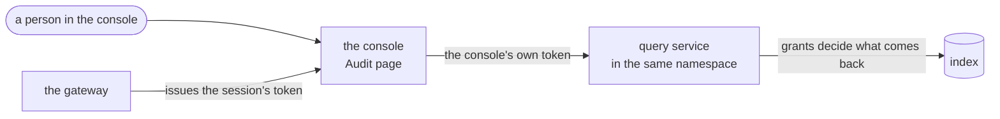

# Integrating an application

An installation belongs to **one application**. It runs in that application's
namespace, rendered by the application's own chart with this repository's
chart as a dependency
([0011](../decisions/0011-one-installation-per-service-or-product.md)). There
is no central installation to connect to, and an application is not a plugin
of one: the trail is a part of the application, the way its database is.

This page is what the application itself ends up with. Running the
installation beside it is [deploying](deploy.md), and the shape it runs in is
[direct](../deployment/direct.md) or [stream](../deployment/stream.md).

## What the application ends up with

| piece | where | what it takes |
|---|---|---|
| a **catalogue** | in the application's repository, next to the code | one YAML document, and a JSON Schema for each action that carries data |
| **one constructor per action** | in the application's code | a function per action name, so the name is spelled once |
| the **emit library** | in the application's process | `emit`, the receiver's address in its own namespace, and the pod's projected service-account token |
| a **CI check** | in the application's pipeline | `audit validate`, `audit check-emitters` |
| the **Audit page** | in the application's console | `@truvity/audit/react`, and the query service's address |

The application holds no credentials for the bucket, the index or the stream:
only the address of a Service in its own namespace. Nothing it runs can read a
record back out either — the query service is the only way in, and it records
every read.

## The catalogue

The catalogue is the contract between the application and its trail. It names
every action the application records and, for each one, what kind of operation
it is, what frameworks call it, which profiles keep a copy, what it is about,
who may act, the schema of its data, its delivery, and how it reads as a
sentence. It lives beside the code that emits it, so the two change together,
and writing it is most of the work of integrating.

```yaml
source: shop            # every action is under this namespace
version: "1.0.0"        # a new version for any change to what a record carries
locales: [en]

actor_kinds:            # who can act, and how profiles treat them
  customer: { category: external }   # an identifier the application minted
  clerk:    { category: internal }   # staff, kept in clear for accountability
  service:  { category: machine }

target_types:           # what an action can be about
  order: { description: "An order." }

actions:
  shop.order.placed:
    summary: A customer placed an order.
    operation: create                     # create, access, modify, remove, authentication, transfer, restore
    categories: [data_change]             # what frameworks call it
    profiles: [security]                  # which copies are kept
    target_types: [order]
    delivery: async                       # block or async: see below
    data_schema: https://schemas.example.com/shop/order-placed.json
    message: { en: "{actor} placed order {targets_0_id}" }
```

Rules that shape the model — the validator enforces each:

- **An action is a fact, named `source.thing.verb`** in the past tense, one
  per thing that can happen. Not one action with a free-text "type" field.
- **The actor is who acted, the subject is who it concerns**, and they differ
  as often as not: a clerk refunds a customer. The actor's **kind** decides
  how each profile treats its identifier, so kinds are about who a party is,
  not what they did.
- **Targets are typed.** An action declares the target types it names, and a
  record names each target by type and id. A string that sometimes means a
  person and sometimes an organisation does not fit.
- **Extra data is a schema, not a map.** Every property says its class — which
  profiles keep it — and whether it is personal data. Direct identity
  attributes, names and e-mail addresses, are refused: a record carries
  identifiers, and a reader resolves them.
- **Templates are ICU MessageFormat** and name the record's fields with
  underscores: `{actor}`, `{targets_0_id}`, `{data_items}`
  ([the list](../reference/catalogue.md#message-templates)).

The complete vocabulary is the
[catalogue reference](../reference/catalogue.md), and the annotations a data
schema may carry are [extension points](../reference/extension-points.md).

**The catalogue is registered at start-up.** The application sends it over
`RegisterCatalogue` before it serves anything, and does not start if it is
refused. The **receiver** answers that call: there is no registry service and
no `audit-registry` binary, because an installation has one application to
hear a catalogue from
([0011](../decisions/0011-one-installation-per-service-or-product.md)).

### Delivery

Delivery is chosen per action in the catalogue, not per installation, so the
same catalogue behaves the same way in either shape. There are two.

| delivery | the application's call returns | if the receiver is down | for |
|---|---|---|---|
| `block` | when the receiver has acknowledged durability | the action **fails**, and the application refuses what it was recording | a privileged sign-in, a key destruction, a billable operation |
| `async` (the default) | at once | the record waits in a bounded in-memory queue and is retried with backoff | everything else |

The acknowledgement always means durable: the object in the bucket in direct
mode, the stream's replicated publish acknowledgement in stream mode.

`outbox` and `best_effort` are **retired**
([0012](../decisions/0012-two-deliveries-and-a-durable-ack.md)). The catalogue
loader refuses both, naming the replacement. There is no file outbox, no
volume on the emitting pod and no `AUDIT_OUTBOX_DIR` to configure.

## One constructor per action

Spell each action name once, in a function that builds its record. It is what
lets `check-emitters` hold the code to the catalogue, and it keeps the shape
of a record — which actor kind, which target type — in one place per action
rather than at every call site.

```go
// Package shopaudit is the only place an action name is spelled.
package shopaudit

import (
	auditv1 "github.com/truvity/audit/gen/audit/v1"
	"github.com/truvity/audit/record"
)

func OrderPlaced(tenant, customerID, orderID string) *record.Record {
	return &record.Record{
		Action:    "shop.order.placed",
		Operation: auditv1.Operation_OPERATION_CREATE,
		TenantId:  tenant,
		Actor:     &record.Actor{Kind: "customer", Id: customerID},
		Targets:   []*record.Target{{Type: "order", Id: orderID}},
		Outcome:   &record.Outcome{Result: auditv1.Outcome_RESULT_SUCCESS},
	}
}
```

Do not build an action name at run time. `check-emitters` cannot see a name
that is assembled from pieces, and the catalogue stops describing the code.

## The emit library

```go
// At start-up: the catalogue reaches the receiver, or the application stops.
if err := emit.Register(ctx, emit.Registration{
	URL: receiverURL, Source: shop.Source, Version: shop.Version,
	Document: document, Schemas: schemas, HTTP: client,
}); err != nil {
	return err
}

emitter, err := emit.New(emit.Options{
	Source:    shop.Source,
	Catalogue: shop,
	Sink:      sink.NewClient(client, receiverURL),
	Version:   build.Version,
	Instance:  os.Getenv("HOSTNAME"),
	Hooks:     hooks, // without OnDropped the emitter logs each drop itself
})

// Wherever the action happens:
err = emitter.Record(ctx, shopaudit.OrderPlaced(tenant, customerID, orderID))
```

- **Identity.** The emitter presents the pod's projected service-account token
  (audience `audit` by default) on every call. The receiver verifies it and
  stamps the service account as the record's observer. A caller never says who
  it is.
- **Request context.** Wrap the HTTP handler in `emit.Middleware(hops)` and
  every record made while serving a request carries its client address, user
  agent, request id and trace id. `hops` is how many proxies of your own sit
  in front.
- **Tenant.** A record belongs to the customer organisation it happened for.
  The application's own operations use `@platform`.
- **Metrics.** Watch `audit.emit.queue.pending` and alert on
  `audit.emit.records.dropped`: a queue that is filling is the warning, a drop
  is the incident.

[Emitting records](emit.md) is the full walkthrough, and
[`examples/emit`](../../examples/emit/main.go) is the working code, compiled
on every run of the gate.

## The CI check

```sh
audit validate catalogue/shop.yaml
audit check-emitters . --catalogue catalogue/shop.yaml
```

`audit validate` holds the catalogue to its format, and with `--deployment` it
also checks the profiles the installation composes against what the catalogue
declares. `audit check-emitters` fails on an action the code emits and the
catalogue does not declare, and on one the catalogue declares and nothing
emits — which is why each action name is a constant or a constructor.

Run both in the application's pipeline. A catalogue is worth being wrong in a
pull request, because it cannot be wrong later in an archive nobody can
rewrite.

## The Audit page

The page lives in the **application's own console**, and normally calls the
query service **directly** with the token the person's session already has.
The console is behind a gateway that issues it, the query service lists that
issuer and audience in its grants, and the grants decide which profiles and
tenants the person may read.



The page holds no credentials of its own: it asks through a transport the
console gives it.

```tsx
import { createConnectTransport } from "@connectrpc/connect-web";
import { createQueryClient } from "@truvity/audit";
import { AuditProvider, AuditView } from "@truvity/audit/react";
import shop from "./audit-sentences.json"; // `audit messages catalogue/shop.yaml`

const audit = createQueryClient(createConnectTransport({
  baseUrl: "https://audit-query.example.com",
  jsonOptions: { useProtoFieldName: true },
  interceptors: [(next) => async (req) => {
    req.header.set("Authorization", `Bearer ${await session.token()}`);
    return next(req);
  }],
}));

<AuditProvider client={audit} sentences={[shop]}>
  <AuditView permalink={(p, id) => `/audit/${p}/${id}`} />
</AuditProvider>
```

- **Sentences** come from the catalogue: `audit messages catalogue/shop.yaml >
  audit-sentences.json` at build time, shipped with the console. The
  component's own actions (`audit.*`) are built in.
- **Profiles**: with none passed, the page asks the query service which
  profiles the person may search (`Access`) and shows those. A console that
  wants fewer passes `profiles`.
- **Grants** are the query service's, not the page's:
  [access](read.md#access) says how they are written, and what the page can
  offer follows from them.

What the view does with a record, and where a console draws its own instead,
is [the Audit page's design](../design/audit-page.md).

### A console with a session of its own

Some consoles do not have a gateway token to pass on: the session is a cookie
of the console's own, and the browser has nothing the query service would
accept. Only then, the console proxies:

```
browser ──(the console's cookie)──▶ console backend ──(a short token per person)──▶ query service
         /audit/audit.v1.QueryService/*                  Authorization: Bearer …
```

- The console backend proxies `/audit/` to the query service, adding a bearer
  token the query service trusts — issued by an issuer its grants name, for
  the signed-in person, with the installation's audience — and refuses the
  proxy to anyone not signed in.
- The browser then points `baseUrl` at `/audit` and sets no header.

It is one more thing to hold correct: a mistake in the proxy is a mistake
about who is asking. Prefer the direct call wherever the console's session is
already a token the query service can verify.

## Checking the integration

- **The catalogue and the code agree**: `audit validate` and
  `audit check-emitters` in CI, on every commit.
- **The installation answers**: with a token that may read,
  `audit conformance --query <url> --profile security --token-file token`
  holds the query service to the search contract over the records the
  application has written.
- **The chain covers them**:
  `audit verify --profile security --last 24h --bucket <bucket> --prefix <prefix> --public-key public.pem`.
- **A `block` action fails when it must.** Stop the receiver and perform one:
  the application must refuse the operation. Perform an `async` action: it
  must succeed, and appear once the receiver is back.

## What not to do

- **Do not pseudonymise or hash identifiers in the application.** The writer
  treats each identity by its category, per profile, with keys the application
  never holds. Where the deployment runs no key provider — the default — it
  declares that its external identifiers are already opaque
  ([0013](../decisions/0013-no-pseudonymisation-keys-by-default.md)), and the
  writer refuses a record that carries something direct.
- **Do not put a writer inside the application.** `writer.Open` and
  `query.New` stay public because the binaries are built on them, but no
  deployment is described that way: it would put the bucket's credentials in
  the application's pods and every fix in its release.
- **Do not read the archive bucket from the application.** Read through the
  query service, which applies the grants and records the read.
