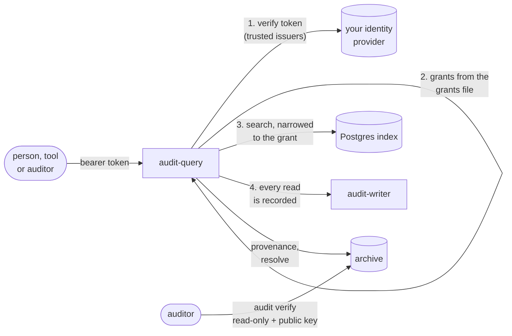

# Reading the trail

How people and programs read the audit trail: who may see what, the API with
examples, the Go and TypeScript clients, and how an auditor checks the archive
without trusting anyone. The Go code is
[`examples/read`](../../examples/read/main.go), compiled on every run of the
gate.



## Access

The query service trusts only the issuers you name, and grants only what its
**grants file** (`--grants`) says:

```yaml
issuers:
  - url: https://id.example.com          # exactly as the tokens' iss claim says it
    audience: audit-prod                 # required: this deployment's own audience

# Groups named <scope>:audit:<role> grant themselves — see the table below.
presets:
  - name: access-roster
    issuer: https://id.example.com

# Anything a group name cannot say is an explicit rule.
rules:
  - name: assessor-2026-q3               # an external assessor: one period only
    issuer: https://id.example.com
    claim: groups
    value: all:audit:assessor
    grant:
      all_tenants: true
      profiles: [security]
      operations: [search, get]
      from: 2026-07-01T00:00:00Z
      until: 2026-10-01T00:00:00Z
  - name: dpo-resolve                    # undoing pseudonyms: one named person
    issuer: https://id.example.com
    claim: sub
    value: dpo@example.com
    grant:
      all_tenants: true
      profiles: [security]
      operations: [resolve]
```

With the `access-roster` preset, a group's name is the grant:

| group | may |
|---|---|
| `<tenant>:audit:viewer` | search, facets, get on the history profile of that tenant |
| `all:audit:security` (or `<tenant>:…`) | search, facets, get, tail, export on the security profiles |
| `all:audit:auditor` | search, facets, get, export on every profile but billing |
| `all:audit:billing` | search, facets, get, export on the billing profiles |
| `all:audit:evidence` | search, get, export on the evidence profile |

`all:audit:viewer` grants nothing, and **no group name grants `resolve`**. A
caller holding several groups gets their union on each profile, never across
profiles. The service refuses to start if the file names no issuer, an issuer
has no audience, or a rule could be satisfied by more than one issuer. The full
rules are in [the configuration reference](../reference/configuration.md#query-service).

Every read — search, facets, get, export, resolve — is itself recorded in the
trail, naming the caller and the rule that allowed it.

## The API

Connect RPC, so every method is a `POST` with a JSON body (or binary protobuf).
JSON field names are snake_case. The contract is
[`query.proto`](../../proto/audit/v1/query.proto); the reference, with the
operators and limits, is [API](../reference/api.md).

**Search**, newest first, one page at a time:

```sh
curl -s https://audit-query.example.com/audit.v1.QueryService/Search \
  -H "Authorization: Bearer $TOKEN" -H 'Content-Type: application/json' \
  -d '{
    "profile": "security",
    "filter": [{
      "occurred_at": {"between": {"from": "2026-09-01T00:00:00Z", "to": "2026-09-18T00:00:00Z"}},
      "action":      {"prefix": "shop.order."},
      "outcome":     {"in": {"values": ["failure", "denied"]}}
    }],
    "limit": 100
  }'
```

The response has `items`, the normalised `query`, and `cursors`. Send
`cursors.next` back as `"cursor"` with the same query for the next page. The
last page's `next` never disappears: asked again later, it returns what was
recorded since, which is how a **tail** works. A search that matches nothing
has no `items` key at all.

Filters are up to four OR-joined conjunctions of typed predicates (`equal`,
`in`, `prefix`, time ranges, predicates on the extension properties a catalogue
marks filterable). There is no free text and no regular expression: both are
unbounded work on a table that only grows.

**Facets**, for navigation:

```sh
curl -s …/audit.v1.QueryService/Facets -H "Authorization: Bearer $TOKEN" -H 'Content-Type: application/json' \
  -d '{"profile": "security", "fields": ["action", "outcome"], "limit_per_field": 10}'
```

**Get** one record, with where its copy is and whether the digest chain vouches
for it:

```sh
curl -s …/audit.v1.QueryService/Get -H "Authorization: Bearer $TOKEN" -H 'Content-Type: application/json' \
  -d '{"profile": "security", "id": "0199b100-0000-7000-8000-00000000001a"}'
```

`provenance.object_key` and `line` locate the copy in the archive;
`digest_id` names the digest that accounts for it; `verified_at` is when that
digest was last verified clean. An empty `verified_at` means not verified yet —
the current hour is never sealed — or the last check found a problem.

**Export** starts a job, **GetExport** polls it and returns a short-lived
download link:

```sh
curl -s …/audit.v1.QueryService/Export -H "Authorization: Bearer $TOKEN" -H 'Content-Type: application/json' \
  -d '{"profile": "security", "filter": [{"action": {"prefix": "shop."}}], "format": "FORMAT_NDJSON"}'
curl -s …/audit.v1.QueryService/GetExport -H "Authorization: Bearer $TOKEN" -H 'Content-Type: application/json' \
  -d '{"job_id": "…"}'
```

**Resolve** maps a pseudonym back to the person, for the cases the law
requires. It needs the `resolve` operation, is recorded before it answers, and
is impossible once the tenant's key has been destroyed:

```sh
curl -s …/audit.v1.QueryService/Resolve -H "Authorization: Bearer $TOKEN" -H 'Content-Type: application/json' \
  -d '{"profile": "security", "tenant_id": "acme", "pseudonym": "ps_…"}'
```

Errors are Connect codes a client can act on: `permission_denied`,
`invalid_argument`, `resource_exhausted`, `not_found` (also for a record outside
your grant), `failed_precondition` (resolving an erased pseudonym),
`unimplemented`, and `unavailable` — retry that one.

## From Go

```go
client := auditv1connect.NewQueryServiceClient(httpClientWithYourBearer, "https://audit-query.example.com")
page, err := client.Search(ctx, connect.NewRequest(&auditv1.SearchRequest{Profile: "security", Limit: 100}))
```

[`examples/read`](../../examples/read/main.go) builds a filtered search, pages
it to the end, and reads one record with its provenance.

## From TypeScript

`@truvity/audit` is the client, the typed contract, the qualifier box compiled
to the typed filter, and records rendered as their catalogues' sentences.
`@truvity/audit/react` adds hooks and a default MUI view. The package is built
from `ts/`. It is not published yet: the first release publishes it to GitHub
Packages.

```ts
import { createConnectTransport } from "@connectrpc/connect-web";
import { compileQualifiers, createQueryClient, Sentencer } from "@truvity/audit";

const audit = createQueryClient(createConnectTransport({
  baseUrl: "https://audit-query.example.com",
  jsonOptions: { useProtoFieldName: true },
  interceptors: [(next) => async (req) => {
    req.header.set("Authorization", `Bearer ${await token()}`);
    return next(req);
  }],
}));

const { filter, errors } = compileQualifiers("outcome:failure,denied since:24h");
const page = await audit.search({ profile: "security", filter: [filter], limit: 100 });
const words = new Sentencer([myCatalogue]); // from `audit messages catalogue.yaml`
for (const r of page.items) console.log(words.sentence(r));
```

## A viewer

`@truvity/audit/react` has a view to put in an application's console. It takes
a client over the host's transport, so the host's own sign-in is what
authenticates it:

```tsx
import { AuditProvider, AuditView } from "@truvity/audit/react";

<AuditProvider client={audit} sentences={[myCatalogue]}>
  <AuditView profiles={["security", "history"]} permalink={(p, id) => `/audit/${p}/${id}`} />
</AuditProvider>
```

It has:

- a tab per profile the caller may read (the host says which);
- the qualifier box and a time range, and counts to narrow by;
- records as sentences, newest first;
- a row that opens to the record, with a chip per value to narrow to it or
  away from it, a link, and whether a verified digest covers it;
- live updates, which need a searcher that orders by recorded time: the index
  does, the archive scan does not.

`useSearch`, `useTail`, `useFacets` and `useRecord` are the same logic without
the MUI view, for a host that draws its own.

**Sentences** come from catalogues. `audit messages catalogue.yaml` prints what
the viewer needs as JSON; ship it with the console. The component's own
actions (`audit.*`) are built in. A standalone console, for a deployment with
no application console to embed it in, is not built yet.

## For an auditor

An auditor does not have to trust the operator, the database or this service.
With read-only access to the archive and the public half of the signing key:

```sh
audit key public --kms-key alias/audit-digest > public.pem   # or --transit-key, or --key
audit verify --profile security --from 2026-09-01 --to 2026-09-18 \
  --bucket example-audit --public-key public.pem
```

It walks the signed chain and reports any object changed, taken away or slipped
in beside it, any gap in the chain, and any lock shorter than the profile
requires. Exit status zero means nothing was found. See
[verification](../operations/verify.md).
